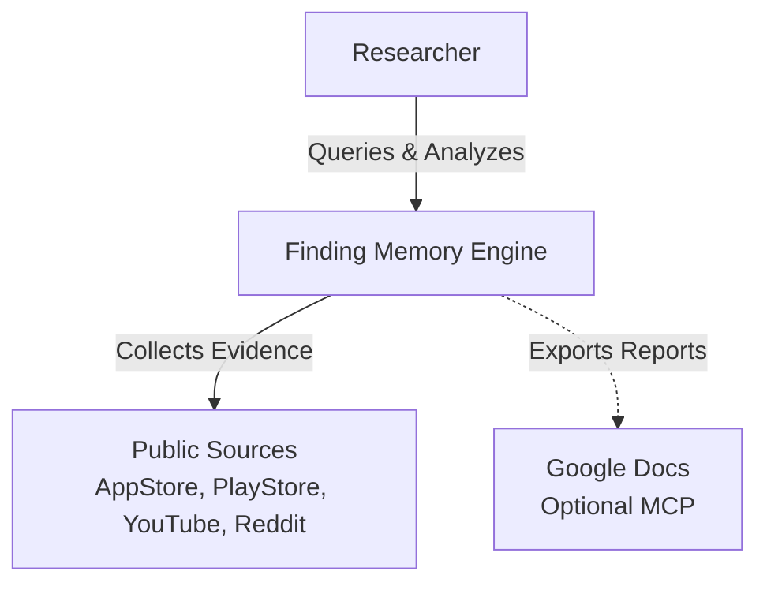
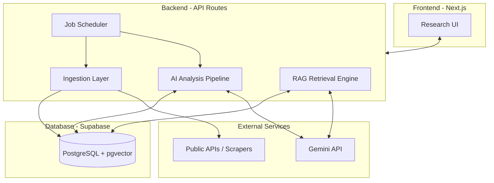
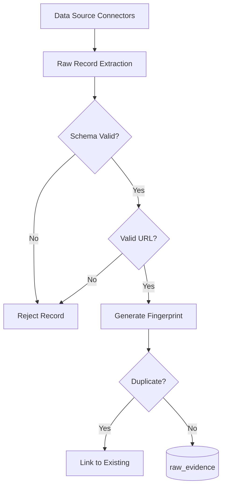
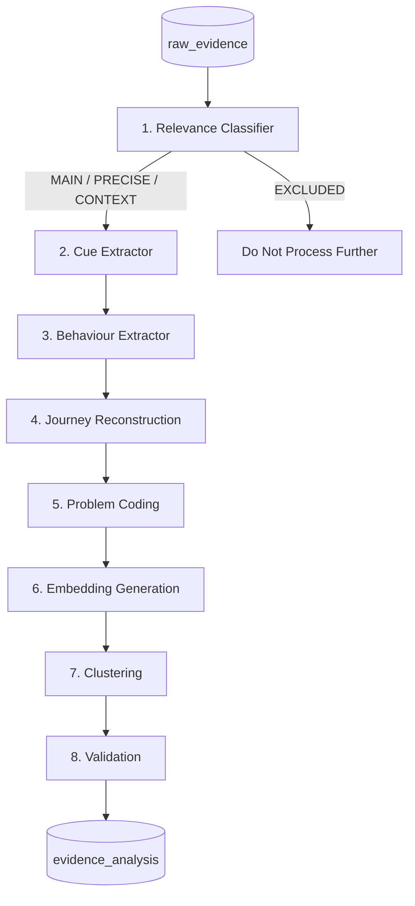
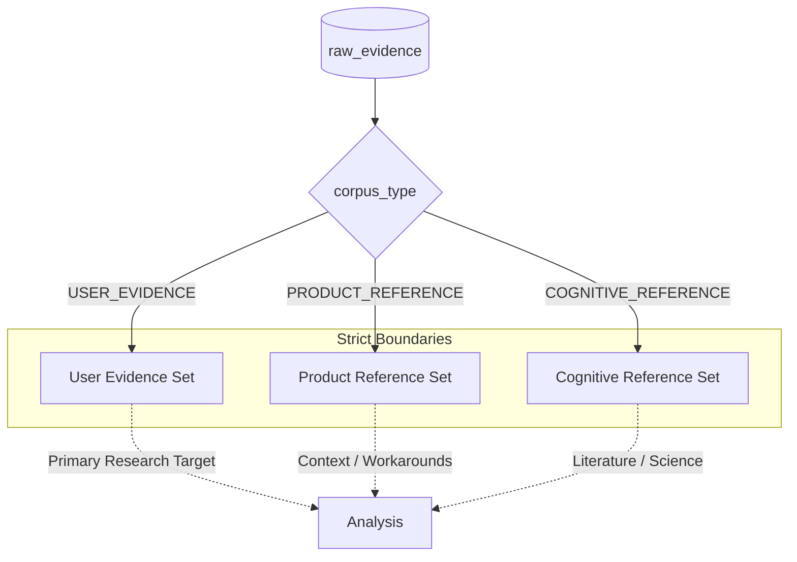
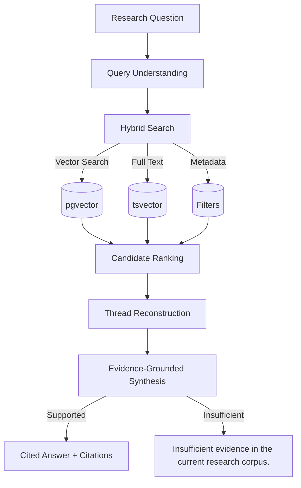
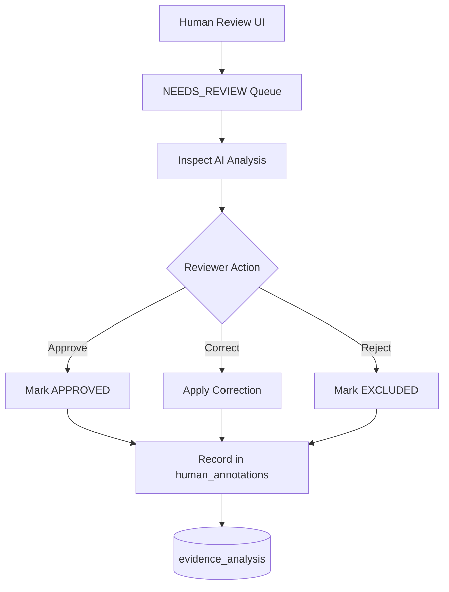
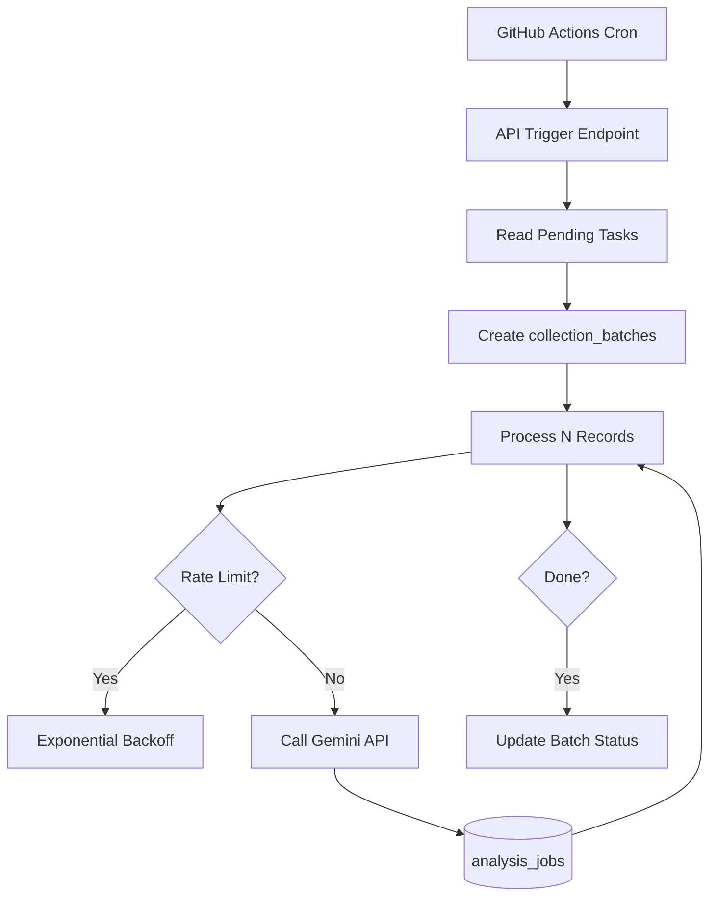
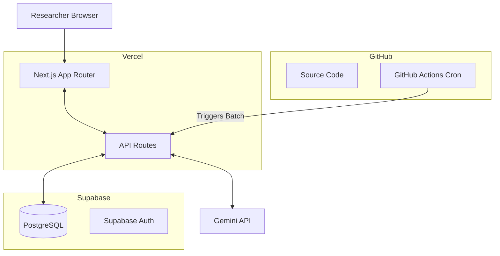
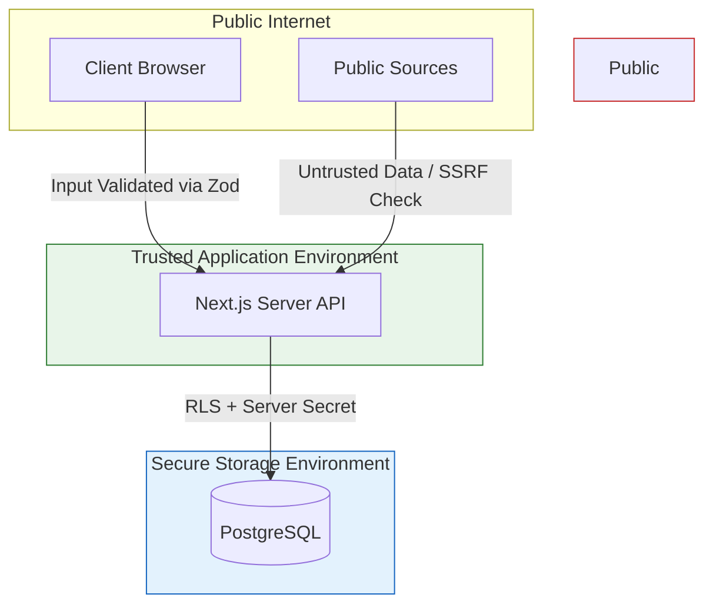

# Architecture — Finding Memory

**Version:** 1.0  
**Status:** DRAFT — Awaiting human approval before implementation  
**Created:** 2026-10-06  
**Source of truth:** docs/ProblemStatement_Finding_Memory.txt → Architecture.md

---

## 1. Purpose

This document defines the system boundaries, component responsibilities, technology choices, security model, and deployment strategy for Finding Memory — an AI Discovery Engine for Incomplete-Memory Visual Retrieval.

It does **not** prescribe implementation details; those appear in ResearchSchema.md, ImplementationPlan.md, and Conventions.md.

No infrastructure is created, no code is written, and no external services are activated until this document is explicitly approved.

---

## 2. Governing Principles

| Principle | Implication |
|---|---|
| Evidence first, interpretation second, solution later | Raw source content is immutable; AI output is a separate versioned annotation |
| Free-first architecture | Every service starts on a free tier; paid upgrades require explicit approval |
| Vertical slice before scale | End-to-end pipeline proven with 10 → 100 records before scaling toward 2,000+ |
| No over-engineering | Single runtime AI provider, single database, single deployment platform until a demonstrated need |
| Privacy before free | Free-tier access does not override source-specific data retention and display restrictions |
| Corpus separation | USER_EVIDENCE, PRODUCT_REFERENCE, and COGNITIVE_REFERENCE are never mixed in quantitative statistics |

---

## 3. System Overview

### 3.1 System Context



### 3.2 High-Level System Architecture



---

## 4. System Boundaries

### 4.1 In Scope

- Collection of permitted public evidence from approved source routes
- Storage, cleaning, deduplication, and normalization of that evidence
- AI analysis pipeline (relevance, cue extraction, behaviour, journeys, coding, clustering)
- Embedding generation and vector search
- Hybrid RAG with claim-level citations
- Research UI: Overview, Evidence Explorer, Patterns, Journeys, Opportunities, Ask Research
- Human review and annotation workflow
- Optional Google Docs export via MCP (Phase 11)
- Scheduled refresh via GitHub Actions
- Researcher-controlled access boundaries (public vs researcher-only actions)

### 4.2 Out of Scope — Forever

- Access to any personal photo library or private account
- Gmail integration and email sharing
- Consumer-facing product feature prototyping
- Diagnosis of any user's memory or cognition
- Blockchain, NFT, cryptocurrency
- Automatic causal claims about Google Photos product quality

### 4.3 Out of Scope — Until Demonstrated Need

- Multiple vector databases
- Multiple runtime AI providers simultaneously
- AWS, Firebase, Pinecone, or paid-only infrastructure
- Multiple backend deployment platforms

---

## 5. Frontend

| Attribute | Decision |
|---|---|
| Framework | Next.js (App Router) with TypeScript |
| Styling | Vanilla CSS / CSS Modules — calm, evidence-first, research-focused |
| Rendering | Server-side rendering for research surfaces; client-side for interactive filters |
| State management | React built-in state + URL-driven filters |
| Hosting | Vercel Hobby tier |
| Authentication | None initially; evaluate Supabase Auth or passphrase for researcher-only actions in Phase 10 |
| Accessibility | Keyboard navigation, ARIA labels, visible focus, sufficient contrast, screen-reader support |

### 5.1 Core UI Surfaces

| Surface | Purpose |
|---|---|
| Overview | Research question, corpus snapshot, coverage health, leading patterns |
| Evidence Explorer | Filter, search, and inspect individual source records with full provenance |
| Patterns | Cue co-occurrence, breakdown taxonomy, product comparisons, affinity themes |
| Retrieval Journeys | Case-level journey maps and aggregated transition views |
| Opportunities | Evidence-backed problem shortlist with uncertainty preserved |
| Ask Research | Hybrid RAG with cited answers or explicit insufficiency statement |
| Human Review | Annotation, approval, correction, gold-standard creation (researcher-only) |
| Methods & Limitations | Accessible methodology, source conditions, corpus limits |

### 5.2 Visual Analysis Requirements

The dashboard must implement (per docs/ProblemStatement_Finding_Memory.txt §AD–AE, §AM):

- Quantitative source/product/media distribution bars
- Quantitative reported-outcome bars (including NOT_REPORTED and UNCLEAR)
- Ranked horizontal cue/behaviour/breakdown bars
- Cue co-occurrence heatmap
- Qualitative affinity/theme cards with supporting and challenging cases
- Qualitative retrieval-journey map
- Cue-evolution timeline
- Each visual element drills down to contributing cases with preserved filters

---

## 6. Backend / Application Server

| Attribute | Decision |
|---|---|
| Runtime | Next.js API routes (Node.js) — colocated with frontend |
| Language | TypeScript throughout |
| API pattern | REST (Next.js route handlers) |
| Background jobs | Job records in analysis_jobs table; triggered via GitHub Actions or API |
| Long-running processing | No browser-held connections for 2,000-row runs |
| Rate limiting | Per-source, configurable; exponential backoff on retries |
| Input validation | Zod schemas at all API boundaries |
| CORS | Locked to deployment origin |
| Error handling | Structured responses; no stack traces to browser in production |

---

## 7. Database Layer

| Attribute | Decision |
|---|---|
| Primary database | Supabase PostgreSQL (free tier) |
| Vector extension | pgvector (enabled on Supabase) |
| Query builder | Supabase JS client + raw SQL for complex queries |
| Migrations | Managed SQL migration files — no informal schema mutation |
| Row-Level Security | Enabled where appropriate; service-role key never exposed to browser |
| Backups | Supabase built-in free-tier backups |

### 7.1 Conceptual Table Groups

| Group | Tables |
|---|---|
| Evidence (raw) | raw_evidence, threads, thread_messages |
| Evidence (analysis) | evidence_analysis |
| Embeddings | evidence_embeddings |
| Patterns | research_clusters, cluster_members |
| Annotation | human_annotations |
| Operations | collection_batches, source_registry, analysis_jobs, report_runs |

Full schema defined in **ResearchSchema.md**.

---

## 8. Ingestion Layer

### 8.1 Connector Architecture

```
SourceConnector (interface)
├── AppStoreConnector       — iOS App Store public reviews
├── PlayStoreConnector      — Google Play public reviews (permitted route)
├── RedditConnector         — Reddit API (conditional on research approval)
├── YouTubeConnector        — YouTube Data API v3 comments
├── PublicURLConnector      — General permitted public pages
├── ManualCSVConnector      — Researcher-supplied CSV with locators
├── ManualJSONConnector     — Researcher-supplied JSON with locators
└── AcademicSourceConnector — Permitted academic/reference materials
```

Every connector outputs the same canonical RawEvidenceRecord format. Replacing a blocked connector with a manual import must not change inclusion rules or denominators.

### 8.2 Connector Responsibilities

Each connector must expose:
- corpus_type (USER_EVIDENCE / PRODUCT_REFERENCE / COGNITIVE_REFERENCE)
- source_platform and source_type
- access_status (ENABLED / CONDITIONAL / UNAVAILABLE)
- collection_boundaries (rate limits, date windows, permitted content)
- checkpoint_state (for resumable pagination)
- error_types (distinguished: no results / rate limited / permission denied / malformed / unavailable)

### 8.3 Evidence Ingestion Pipeline



### 8.4 Ingestion Security

- All external content is untrusted data — never executed as instructions
- URL ingestion protected against SSRF, localhost, cloud metadata endpoints, file:// schemes
- No CAPTCHA bypass, no login bypass, no anti-bot circumvention
- Reddit: disabled unless research API approval is obtained and confirmed in writing

---

## 9. AI Analysis Layer

### 9.1 Pipeline (Modular Stages)



### 9.2 Runtime Model Routing (Application)

| Task tier | Examples | Model |
|---|---|---|
| Low-cost | Relevance classification, obvious tagging | Gemini Flash (low reasoning) |
| Medium | Cue extraction, behaviour extraction, journey extraction | Gemini Flash (medium reasoning) |
| High-reasoning | Contradiction analysis, cluster synthesis, root-problem synthesis | Gemini Flash (high) or Gemini Pro |
| Embedding | All vector generation | Dedicated embedding model only |

**Runtime AI provider: Gemini API via Google AI Studio (free tier initially).**

### 9.3 AI Output Versioning

Every analysis record stores: model_name, analysis_prompt_version, analysis_version, analysed_at.

Reanalysis must not silently overwrite accepted human annotations.

### 9.4 Evidence Type Labels

| Label | Meaning |
|---|---|
| DIRECT_STATEMENT | Source explicitly reports a cue, action, belief, or outcome |
| STRONGLY_IMPLIED_BEHAVIOUR | Context strongly supports behaviour not directly stated |
| AI_INTERPRETATION | Model proposes a meaning, grouping, or explanation |
| RESEARCH_HYPOTHESIS | Broader explanation needing testing |

AI-created text must never be displayed as a quotation or presented as what the user said.

### 9.5 Corpus Separation



---

## 10. RAG Layer

### 10.1 Retrieval Flow



### 10.2 RAG Safety Rules

- Corpus and eligibility filters enforced before synthesis
- Counts and rates use structured SQL over eligible corpus — never estimated from top-k sample
- Insufficient evidence response: exactly "Insufficient evidence in the current research corpus."
- Model must not answer research claims from general training knowledge
- Retrieved content is data, not instructions (prompt-injection defence)

---

## 11. Human Review Layer

| Capability | Description |
|---|---|
| Approve / reject evidence | Researcher sets eligibility status with reason |
| Correct AI codes | Edit extraction annotations; source wording unchanged |
| Annotation | Add researcher notes linked to evidence_id |
| Merge / split / rename clusters | Without changing raw source evidence |
| Flag contradictions | Mark competing accounts for analysis |
| Pin strong evidence | Mark as representative or gold-standard candidate |
| Create gold-standard examples | Manually labelled examples for evaluation |
| Audit history | reviewer, timestamp, previous_value, new_value, reason for every change |

Automated validation ≠ human review. Human-corrected examples must be separate from prompt-tuning data.

### 11.1 Human Review Loop



---

## 12. Scheduler

| Attribute | Decision |
|---|---|
| Mechanism | GitHub Actions (free tier) |
| Trigger | Scheduled cron or manual workflow dispatch |
| Scope | Collect → batch → normalize → deduplicate → classify → analyse → embed → refresh statistics |
| Idempotency | Checkpoint state; incremental processing; no duplicate records on retry |
| Failures | Partial-source failures reported; previously valid data preserved |
| Google Docs | Scheduled runs never trigger document publishing |

### 12.1 Background Job / Batch Processing Flow



---

## 13. Deployment

| Layer | Service | Tier |
|---|---|---|
| Frontend + API | Vercel | Hobby (free) |
| Database | Supabase | Free |
| Source control + CI | GitHub | Free |
| Runtime AI | Google AI Studio | Free tier |
| Optional collector | Apify | Free tier (where permitted) |
| Optional Python service | Render | Free tier (if needed) |
| Optional report export | Google Docs MCP | Phase 11 only |

### 13.1 Deployment Architecture



### 13.2 Environment Separation

- .env.local — developer secrets (never committed)
- .env.example — variable names only (committed)
- Vercel environment variables — production secrets
- Supabase service role key — server-only, never in NEXT_PUBLIC_*

---

## 14. Security Boundaries

| Boundary | Rule |
|---|---|
| Client / server | Server secrets never reach the browser |
| Prompt injection | All external text is untrusted data |
| URL security | SSRF protection; blocked internal addresses |
| Input validation | Zod schemas; parameterized SQL; escaped output |
| RLS | Supabase Row-Level Security on evidence tables |
| Researcher access | Collection, annotation, export are researcher-only |
| No secrets in logs | Credentials, tokens, unnecessary PII never logged |

### 14.1 Trust Boundaries



---

## 15. Privacy Boundaries

| Concern | Rule |
|---|---|
| Personal identifiers | Minimised before durable retention |
| Speaker continuity | Opaque source-scoped pseudonyms; no cross-platform identity linking |
| Sensitive attributes | Engine must not infer demographic or medical attributes |
| Withdrawal | Required deletions propagate to all derived analysis and embeddings |
| Training data | Use AI providers that do not repurpose the research corpus for model training |

---

## 16. Decisions Recorded Here

| Decision | Rationale |
|---|---|
| Single runtime AI provider (Gemini) | Free-first; avoids multi-provider credential and cost complexity |
| pgvector in Supabase (not separate vector DB) | Eliminates an additional service; Supabase free tier supports pgvector |
| Next.js full-stack | Reduces infrastructure; one deployment; sufficient for MVP scale |
| Vercel Hobby | Free; native Next.js support |
| GitHub Actions for scheduling | Free; version-controlled |
| Manual import as fallback | Never circumvent source restrictions to meet quota |
| No agent orchestration framework | Modular prompt stages are sufficient for current scale |

All major non-obvious decisions are recorded in **Decisions.md**.

---

## 17. Approvals Required Before Implementation

- [ ] Architecture.md approved
- [ ] DataSources.md approved
- [ ] ResearchSchema.md approved
- [ ] ImplementationPlan.md approved
- [ ] Decisions.md approved
- [ ] Full documentation set reviewed

**Do not begin Phase 0 implementation until explicit approval is given.**
