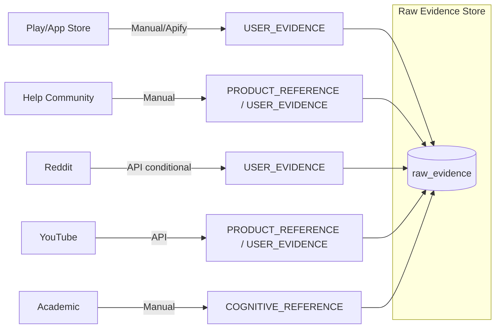

# DataSources — Finding Memory

**Version:** 1.0  
**Status:** DRAFT — Awaiting human approval before implementation  
**Created:** 2026-10-06  
**Source of truth:** docs/ProblemStatement_Finding_Memory.txt §G–L, §Y, §AT

---

## 1. Three Independently Labelled Corpora

Finding Memory maintains three corpora with separate record totals, retrieval filters, and reporting denominators. They must never be blended in quantitative user-behaviour statistics.

| Corpus | Label | Permitted use | Counting rule |
|---|---|---|---|
| USER_EVIDENCE | Real public accounts of visual retrieval attempts | Behavioural coding, journeys, patterns, corpus-level counts | Count only qualifying unique evidence; distinguish main cases from controls and context |
| PRODUCT_REFERENCE | Official product help, capability documentation, release information | Explain intended support, prerequisites, feature changes | Never count as user behaviour or toward the 2,000-record target |
| COGNITIVE_REFERENCE | Academic literature and clearly labelled educational references | Frame questions; interpret possible mechanisms cautiously | Never count as a user case or proof that a mechanism occurred |

A thread may contain USER_EVIDENCE (original poster's account) and PRODUCT_REFERENCE (official capability explanation) in the same source. Classification happens at the relevant content level, not the whole source page.

RAG may use multiple corpora when a question requires them, but must label each corpus's contribution. Corpus statistics must never blend the three. Reference-supported explanations and user-reported experiences may disagree; both must be preserved.

### 1.1 Corpus Data Flow

---

## 2. Source Priority

Sources are listed by expected evidence density for incomplete-memory retrieval cases. Priority does not override access restrictions.

| Priority | Source | Corpus | Rationale |
|---|---|---|---|
| 1 | Google Photos Help Community | USER_EVIDENCE | Long community threads with queries, clarifications, workarounds, and outcomes |
| 2 | Google Play Reviews (Google Photos) | USER_EVIDENCE | High volume; short-form retrieval complaints and successes |
| 3 | Google Photos iOS App Store Reviews | USER_EVIDENCE | Complementary platform coverage |
| 4 | r/googlephotos (Reddit) | USER_EVIDENCE | Detailed threads; conditional on Reddit research-access approval |
| 5 | Other relevant Reddit communities | USER_EVIDENCE | r/tipofmytongue, r/HelpMeFind (visual cases only); conditional on approval |
| 6 | YouTube video comments | USER_EVIDENCE | Tutorial and review comment sections; relevant retrieval discussions |
| 7 | Apple Support Community | USER_EVIDENCE | Apple Photos comparison corpus |
| 8 | Apple App Store Reviews (Photos) | USER_EVIDENCE | Apple Photos comparison |
| 9 | Amazon Photos reviews/forums | USER_EVIDENCE | Amazon Photos comparison |
| 10 | Samsung Community / Gallery reviews | USER_EVIDENCE | Samsung Gallery comparison |
| 11 | Microsoft Support / OneDrive forums | USER_EVIDENCE | Microsoft Photos / OneDrive comparison |
| 12 | Dropbox community / reviews | USER_EVIDENCE | Adjacent cloud-content retrieval comparison |
| 13 | Pinterest public discussions | USER_EVIDENCE | Visual similarity and saved-content retrieval analogue |
| 14 | Instagram / TikTok public posts | USER_EVIDENCE | Behavioural analogues only; severe access restrictions |
| 15 | Public forums / web discussions | USER_EVIDENCE | General web search for relevant retrieval accounts |
| 16 | Manual CSV / JSON imports | USER_EVIDENCE | Researcher-supplied, source-verified records |
| 17 | Google Photos Help / Support pages | PRODUCT_REFERENCE | Official capability documentation |
| 18 | Apple / Amazon / Samsung / Microsoft docs | PRODUCT_REFERENCE | Comparison product documentation |
| 19 | Academic literature (memory/retrieval) | COGNITIVE_REFERENCE | Cognitive science grounding |
| 20 | Educational references | COGNITIVE_REFERENCE | Orientation only; must be labelled |

---

## 3. Source-by-Source Detail

### 3.1 Google Photos Help Community

| Field | Value |
|---|---|
| Corpus | USER_EVIDENCE |
| Platform label | google_photos_help_community |
| Product | Google Photos |
| Collection method | Public page collection (permitted route to be confirmed) or manual import |
| API availability | No official API identified; public web pages |
| Manual import fallback | YES — researcher copies qualifying threads as ManualJSON/CSV with source URL |
| Access restrictions | Public pages; individual post URLs required for record identity |
| Deduplication keys | Thread URL + message-level locator (post ID or sequence position) |
| Source provenance | Thread URL, message position, timestamp (if available), speaker label |
| Priority | 1 (highest density for detailed journey evidence) |
| Notes | Original post + replies + OP updates required for journey reconstruction |

### 3.2 Google Play Reviews — Google Photos

| Field | Value |
|---|---|
| Corpus | USER_EVIDENCE |
| Platform label | google_play_store |
| Product | Google Photos |
| Package ID | com.google.android.apps.photos |
| Collection method | Compliant public collection route (Apify or permitted scraper) OR manual import |
| API availability | Official Google Play developer API [Y1] is publisher-only and cannot be used for Google Photos reviews; no assumption of unrestricted official API |
| Manual import fallback | YES — researcher exports or manually copies reviews with source context |
| Access restrictions | Public listing; review-level locator (review ID or unique content hash) required |
| Deduplication keys | review_id (if available) + platform + product |
| Source provenance | App store URL, country/region, star rating (metadata), review timestamp |
| Priority | 2 |
| Notes | Do not use rating alone as severity indicator; collect neutral and positive reviews |

### 3.3 Google Photos iOS App Store Reviews

| Field | Value |
|---|---|
| Corpus | USER_EVIDENCE |
| Platform label | apple_app_store |
| Product | Google Photos (iOS) |
| APP_STORE_ID | 962194608 (verify before collection) |
| Collection method | Public RSS feed or permitted public collection; manual import as fallback |
| API availability | Limited public RSS; developer-owned review API not available to third parties |
| Manual import fallback | YES |
| Access restrictions | Review caps per feed, locale-specific feeds |
| Deduplication keys | review_id + APP_STORE_COUNTRY |
| Source provenance | App store URL, country, rating, date |
| Priority | 3 |
| Notes | Support APP_STORE_COUNTRY as configuration parameter |

### 3.4 Reddit — r/googlephotos and Related Communities

| Field | Value |
|---|---|
| Corpus | USER_EVIDENCE |
| Platform label | reddit |
| Subreddits of interest | r/googlephotos, r/tipofmytongue (visual cases), r/HelpMeFind (visual cases), r/applehelp, r/googlepixel (retrieval cases) |
| Collection method | Reddit API (Responsible Builder Policy; research-programme approval required) |
| API availability | **CONDITIONAL** — Reddit's Responsible Builder Policy [Y4] requires approval for API access; research use outside the approved researcher programme [Y5] is not assumed to be permitted |
| Manual import fallback | YES — if API approval is not obtained, mark source UNAVAILABLE and use manual imports of publicly visible threads only where permitted |
| Access restrictions | Approval required; AI-processing and redistribution restrictions apply; raw Reddit data must not be exposed in public RAG responses without permitted excerpts only |
| Deduplication keys | Reddit post ID + comment ID |
| Source provenance | Subreddit, post ID, comment ID, author label (pseudonymous), timestamp |
| Status | **CONDITIONAL — requires approval before implementation** |
| Priority | 4 |
| Notes | Reddit must not be a blocking dependency for MVP completion. Recheck current policy at collection time. |

### 3.5 YouTube Comments

| Field | Value |
|---|---|
| Corpus | USER_EVIDENCE |
| Platform label | youtube |
| Target videos | Google Photos tutorials, review videos, Ask Photos feature explanations, complaint compilations; Apple Photos comparisons |
| Collection method | YouTube Data API v3 [Y2–Y3] — CommentThreads.list + Comments.list for replies |
| API availability | YES — YouTube Data API v3 with API key (YOUTUBE_API_KEY) |
| Manual import fallback | YES |
| Access restrictions | Disabled comments, inaccessible videos, quota limits, incomplete replies (YouTube may omit some replies in commentThread resource) |
| Deduplication keys | YouTube video ID + comment ID |
| Source provenance | Video URL, channel, comment ID, timestamp |
| Status | ENABLED (API key required — not needed until YouTube phase begins) |
| Priority | 6 |
| Notes | Collect relevant retrieval-related comments only; do not indiscriminately ingest all comments |

### 3.6 Apple Support Community

| Field | Value |
|---|---|
| Corpus | USER_EVIDENCE |
| Platform label | apple_support_community |
| Product | Apple Photos |
| Collection method | Public page collection or manual import |
| API availability | No official third-party API identified |
| Manual import fallback | YES |
| Access restrictions | Public pages; thread/post-level locator required |
| Deduplication keys | Thread URL + post position/ID |
| Source provenance | Thread URL, post ID, timestamp |
| Priority | 7 |

### 3.7 Amazon Photos Reviews / Forums

| Field | Value |
|---|---|
| Corpus | USER_EVIDENCE |
| Platform label | amazon_photos |
| Collection method | Eligible app reviews, public support discussions, forums — public collection or manual import |
| API availability | Verify current Amazon product-review collection options |
| Manual import fallback | YES |
| Access restrictions | Region-specific; review-level locator required |
| Deduplication keys | review_id or content hash + platform |
| Priority | 9 |

### 3.8 Samsung Community / Galaxy Store Reviews

| Field | Value |
|---|---|
| Corpus | USER_EVIDENCE |
| Platform label | samsung_community |
| Collection method | Public community pages, relevant store reviews, forums — public collection or manual import |
| API availability | No official third-party API confirmed |
| Manual import fallback | YES |
| Access restrictions | Public pages; post-level locator required |
| Priority | 10 |

### 3.9 Microsoft Support / OneDrive Forums

| Field | Value |
|---|---|
| Corpus | USER_EVIDENCE |
| Platform label | microsoft_support |
| Products | Microsoft Photos, OneDrive Photos (treated as separately identified experiences) |
| Collection method | Public support pages, forums — public collection or manual import |
| API availability | No official third-party content API confirmed |
| Manual import fallback | YES |
| Priority | 11 |

### 3.10 Dropbox Community / Reviews

| Field | Value |
|---|---|
| Corpus | USER_EVIDENCE |
| Platform label | dropbox |
| Collection method | Public community posts, eligible reviews — public collection or manual import |
| API availability | Verify current options |
| Manual import fallback | YES |
| Priority | 12 |
| Notes | Adjacent retrieval comparator — screenshot/document retrieval via name, folder, content, source context |

### 3.11 Pinterest / Instagram / TikTok (Behavioural Analogues)

| Field | Value |
|---|---|
| Corpus | USER_EVIDENCE (analogue cases only) |
| Platform labels | pinterest, instagram, tiktok |
| Collection method | Manual import only; official APIs for research use are restricted or unavailable |
| API availability | **Severely restricted** — do not assume official APIs permit arbitrary public-content research; check current policies before building automated ingestion |
| Manual import fallback | YES — compliant manual curator only |
| Access restrictions | High; public visibility alone does not authorise collection or redistribution |
| Deduplication keys | Post URL + collected timestamp |
| Priority | 13–14 |
| Notes | Analogue cases must not be pooled into Google Photos-specific statistics; record whether task is exact retrieval, rediscovery, identification, or similarity discovery |

### 3.12 General Public Web Discussions

| Field | Value |
|---|---|
| Corpus | USER_EVIDENCE |
| Platform label | public_web |
| Collection method | PublicURLConnector with SSRF protection; manual import |
| API availability | No unified API; source-specific public access |
| Manual import fallback | YES |
| Access restrictions | robots.txt, access restrictions, and reuse conditions must be checked per site |
| Deduplication keys | Canonical URL + content hash |
| Priority | 15 |

### 3.13 Manual CSV / JSON Imports

| Field | Value |
|---|---|
| Corpus | Any (specified at import) |
| Platform label | manual_import |
| Collection method | Researcher supplies file with mandatory source URL, platform, and capture date |
| Verification | Imported records remain UNVERIFIED until source-checked |
| Restrictions | Cannot bypass source restrictions; public URL is not a workaround for a prohibition |
| Required fields | source_url, platform, collected_at, capture_context |
| Priority | 16 |

---

## 4. PRODUCT_REFERENCE Sources

| Source | URL (verified 2026-10-06) | Notes |
|---|---|---|
| Google Photos — Search by people, things, places | https://support.google.com/photos/answer/15235862 | [K1] — baseline search capabilities |
| Google Photos — Ask Photos | https://support.google.com/photos/answer/15318661 | [K2] — Ask Photos feature |
| Apple — Search photos/videos on iPhone | https://support.apple.com/en-mide/guide/iphone/-iph392d77d5f/ios | [K3] — Apple Photos search |
| Amazon Photos help | To be confirmed at collection time | Verify product identifiers first |
| Samsung Gallery search documentation | To be confirmed | Verify product identifiers |
| Microsoft Photos / OneDrive photo search | To be confirmed | Distinguish Microsoft Photos from OneDrive |
| Dropbox retrieval documentation | To be confirmed | |
| Pinterest visual search documentation | To be confirmed | |

Each reference must retain: title, publisher, URL, access date, publication/update date, platform, region/language caveats, applicable feature/version context. Where documentation does not establish a capability, record as unresolved rather than absent.

**Important:** These references document intended capabilities that already exist beyond a simple date-only interface. Research must examine supported use, observed behaviour, and remaining gaps — not assume features are missing.

---

## 5. COGNITIVE_REFERENCE Sources

Topics for literature collection (literature review not yet conducted):

- Retrieval cues and cue-dependent recall
- Encoding specificity
- Recognition versus recall
- Episodic memory and autobiographical memory
- Visual imagery and visual memory
- Reconstructive memory
- Interference and source-memory errors
- Context-dependent retrieval
- Memory accessibility versus availability

Target sources: peer-reviewed primary studies and reviews, academic journals, academic books, PubMed/PMC, reputable university sources. Secondary educational material may support orientation but must be labelled and must not anchor major research claims.

Per-reference record: research question, study population, task, central result, limitations, citation/DOI, relevance to project. Access via PubMed/PMC does not by itself establish quality or applicability.

---

## 6. Collection Method Reference

| Method | When used | Connector |
|---|---|---|
| Public review feed / RSS | When a compliant public feed exists | AppStoreConnector, PlayStoreConnector |
| Official API | When a permitted API exists | YouTubeConnector, RedditConnector (conditional) |
| Public page collection | Where permitted by site terms | PublicURLConnector |
| Third-party compliant collector | Where source rules permit | Apify via PlayStoreConnector or PublicURLConnector wrapper |
| Manual import (CSV) | Researcher-supplied datasets with locators | ManualCSVConnector |
| Manual import (JSON) | Researcher-supplied structured records | ManualJSONConnector |
| Academic database | Permitted academic literature | AcademicSourceConnector |

---

## 7. Access Status Labels

| Status | Meaning |
|---|---|
| ENABLED | Confirmed permitted collection route; credentials configured |
| CONDITIONAL | Permitted route exists but requires approval, confirmation, or additional setup |
| UNAVAILABLE | No permitted route confirmed; source excluded; coverage gap reported |
| MANUAL_ONLY | No programmatic route; manual import only |
| NOT_VERIFIED | Route exists but terms/permissions not yet confirmed |

---

## 8. Deduplication Keys by Source Type

| Source type | Primary deduplication key | Secondary |
|---|---|---|
| App Store review | review_id + APP_STORE_COUNTRY + app_id | Content hash |
| Play Store review | review_id + app_package | Content hash |
| Reddit post | reddit_post_id | — |
| Reddit comment | reddit_post_id + reddit_comment_id | — |
| YouTube comment | youtube_video_id + youtube_comment_id | — |
| Help community thread | Thread URL + message position/ID | Content hash |
| Manual import | source_url + content hash | — |
| Academic reference | DOI or publication_url | Title + authors |

---

## 9. Source Provenance Fields (Every Record)

Every accepted evidence record must carry:

| Field | Description |
|---|---|
| evidence_id | Stable system-generated identifier |
| corpus_type | USER_EVIDENCE / PRODUCT_REFERENCE / COGNITIVE_REFERENCE |
| source_platform | Identifier string (google_play_store, apple_app_store, reddit, etc.) |
| source_type | review / community_post / youtube_comment / manual_import / academic / etc. |
| product_name | Named product (Google Photos, Apple Photos, etc.) |
| source_url | Canonical locator |
| original_url | Pre-canonicalization URL |
| parent_thread_url | For threaded discussions |
| source_record_id | Source-platform-specific identifier where available |
| published_at | Publication timestamp (preserved precision) |
| collected_at | Collection timestamp |
| collection_method | Method string |
| collection_batch_id | Links to collection_batches table |
| verification_status | UNVERIFIED / SOURCE_VERIFIED / HUMAN_REVIEWED |
| source_access_notes | Any conditions on display, reuse, or AI processing |

---

## 10. Source Compliance Rules

Before enabling any source:

1. Document the permitted access route
2. Record approval status (with reference URL and date)
3. Confirm applicable rate/retention conditions
4. Confirm AI-processing restrictions
5. Confirm permitted display/export audience
6. Record in source_registry table

Public visibility alone does not authorise bulk collection, reuse, redistribution, or AI processing.

Where programmatic access is unavailable, use a legitimate manual route only if that route and intended use are explicitly allowed.

If no permitted route exists, mark the source UNAVAILABLE and report the coverage gap in corpus statistics.

**Reddit reminder:** Current Reddit research-access restrictions [Y4–Y5] are a concrete limitation. Do not dilute these conditions to meet the 2,000-record quota. Reassess at actual collection time.

---

## 11. Source Registry

The `source_registry` table in the database tracks:

| Field | Description |
|---|---|
| source_id | Stable identifier |
| source_platform | Platform label |
| corpus_type | Which corpus |
| access_status | ENABLED / CONDITIONAL / UNAVAILABLE / MANUAL_ONLY |
| permitted_route | Description of the permitted collection method |
| terms_url | Reference URL for applicable terms |
| approval_date | When access was confirmed |
| ai_processing_permitted | Whether AI analysis of this source's content is allowed |
| display_conditions | What can be shown publicly vs researcher-only |
| rate_limits | Known rate or quota limits |
| notes | Any additional conditions |

---

## 12. Source Coverage Reporting

All published corpus statistics must report:

- Total collected records (all statuses)
- Verified qualifying records (main incomplete-memory corpus)
- Control records (PRECISE_MEMORY_SYSTEM_FAILURE)
- Context-only records
- Excluded records (with primary exclusion reason counts)
- Inaccessible or unavailable sources
- Shortfall from 2,000-record target (if applicable)
- Corpus snapshot date

Never synthesize, expand, or invent records to meet the target. A smaller corpus with accurate provenance is preferable to an inflated corpus with uncertain origin.
