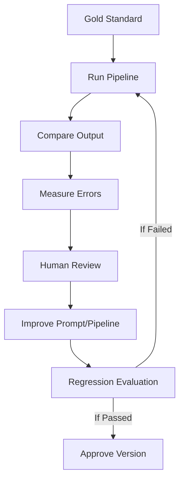

# Evals — Finding Memory

**Version:** 1.0  
**Status:** DRAFT — Awaiting human approval before implementation  
**Created:** 2026-10-06  
**Source of truth:** AntigravityMasterPrompt.txt §BZ–CA; docs/ProblemStatement_Finding_Memory.txt §AX

---

## 1. Purpose

This document defines the evaluation strategy, metrics, gold-standard set construction, and result-recording approach for the Finding Memory AI analysis pipeline and RAG system.

Evaluations are run at defined gates. Actual results are recorded in this document as they are completed.

---

## 2. Governing Rules

1. Do not use AI-generated labels alone as ground truth — all gold-standard labels require human verification
2. Gold-standard examples designated for evaluation must be held out from prompt-development iteration
3. Deterministic logic: tested with unit tests — no expensive LLM calls
4. AI extraction/RAG quality: tested with the gold-standard evaluation set described below
5. Eval results must use plain language labels (HIGH / MEDIUM / LOW) — not invented numeric probabilities
6. All evaluation runs report N, method, corpus snapshot date, and model+prompt version
7. Results that do not meet targets must be investigated and documented; do not lower targets post-hoc without justification

---

## 3. Gold-Standard Set Construction

### 3.1 Set Composition (Target: 150 Examples)

| Category | Examples | Purpose |
|---|---|---|
| Highly relevant retrieval (MAIN_INCOMPLETE_MEMORY, unambiguous) | 20 | Precision anchor |
| Highly relevant retrieval (MAIN_INCOMPLETE_MEMORY, borderline) | 15 | Precision boundary |
| Precise-memory system failure (PRECISE_MEMORY_SYSTEM_FAILURE) | 20 | Recall control group |
| Context-only (CONTEXT_ONLY) | 10 | Exclusion accuracy |
| Clearly irrelevant / excluded | 10 | Exclusion accuracy |
| Incomplete memory (no visible action) | 10 | Scope clarity |
| Incomplete memory with uncertain cue | 10 | Cue state labelling |
| Incorrect cue (POSSIBLY_WRONG or CONTRADICTORY) | 5 | Cue state diversity |
| Newly recalled cue | 5 | Cue evolution |
| Successful retrieval (FOUND) | 10 | Outcome accuracy |
| Failed retrieval (FAILED) | 10 | Outcome accuracy |
| Abandonment (ABANDONED) | 5 | Outcome accuracy |
| Not-reported outcome (NOT_REPORTED) | 5 | Outcome: no-reply default |
| Thread context (multi-message) | 10 | Journey labelling |
| Contradiction (conflicting accounts) | 5 | Alternative interpretation |

**Total target: 150 examples** (40 initially; 110 added by Phase 13)

### 3.2 Construction Rules

- All gold-standard examples are real collected evidence records (not synthetic)
- Labels applied by at least one researcher
- For important examples: independently double-coded by a second researcher (minimum 30 out of 150)
- Agreement rate must be computed and recorded for double-coded examples
- Disagreements: resolved via discussion; resolution and rationale documented in this file
- Gold-standard examples are held out from prompt-iteration refinement cycles
- A separate subset of records (not in gold standard) may be used for prompt development

---

## 4. Evaluation Schedule

| Gate | Phase | What is evaluated | Gold-standard set size |
|---|---|---|---|
| E1 | Phase 4 | Relevance classifier (v1) | First 40 examples |
| E2 | Phase 5 | Extraction pipeline (cues, behaviours, outcomes) | 80 examples |
| E3 | Phase 6 | Thread / journey reconstruction | 80 examples (threaded subset) |
| E4 | Phase 8 | RAG: citations, synthesis, insufficiency | 50 research questions |
| E5 | Phase 13 | Full held-out evaluation before deployment | All 150 examples + 50 RAG questions |

### 4.1 Evaluation Loop

---

## 5. Relevance Classifier Evaluation (E1, E5)

### 5.1 Metrics

| Metric | Formula | Target | Actual (E1) | Actual (E5) |
|---|---|---|---|---|
| Precision (MAIN) | TP / (TP + FP) | ≥ 0.90 | TBD | TBD |
| Recall (MAIN) | TP / (TP + FN) | ≥ 0.80 | TBD | TBD |
| Precision (PRECISE) | TP / (TP + FP) | ≥ 0.85 | TBD | TBD |
| Recall (PRECISE) | TP / (TP + FN) | ≥ 0.80 | TBD | TBD |
| Exclusion accuracy | Correctly excluded / total excluded in GS | ≥ 0.85 | TBD | TBD |
| NEEDS_REVIEW rate | Ambiguous records in NR / total | Informational only | TBD | TBD |

**Definitions:**
- TP: AI labelled MAIN_INCOMPLETE_MEMORY; human labelled MAIN_INCOMPLETE_MEMORY
- FP: AI labelled MAIN_INCOMPLETE_MEMORY; human labelled different category
- FN: AI labelled different category; human labelled MAIN_INCOMPLETE_MEMORY
- Ambiguous cases that AI sends to NEEDS_REVIEW are counted as neither TP nor FP for precision; they are counted as FN for recall

### 5.2 Failure Analysis

For each false positive and false negative, record:
- evidence_id
- AI output (category + rationale)
- Human label and reasoning
- Hypothesis for why the error occurred
- Whether the error reveals a prompt gap

---

## 6. Extraction Pipeline Evaluation (E2, E5)

### 6.1 Cue Extraction

| Metric | Formula | Target | Actual (E2) | Actual (E5) |
|---|---|---|---|---|
| Cue-level precision | Correctly extracted cues / all AI-extracted cues | ≥ 0.85 | TBD | TBD |
| Cue-level recall | Correctly extracted cues / all human-identified cues | ≥ 0.80 | TBD | TBD |
| Cue state accuracy | Correct cue_state / total extracted cues | ≥ 0.85 | TBD | TBD |
| Evidence label accuracy | Correct evidence_label / total extracted cues | ≥ 0.90 | TBD | TBD |
| FORGOTTEN false positive rate | AI labels FORGOTTEN without explicit source text / total FORGOTTEN labels | ≤ 0.05 | TBD | TBD |
| Source span accuracy | AI source_span contains gold text / total cues with source spans | ≥ 0.80 | TBD | TBD |

### 6.2 Action and Behaviour Extraction

| Metric | Formula | Target | Actual (E2) | Actual (E5) |
|---|---|---|---|---|
| Advice vs action separation | Actions correctly attributed to OP vs commenter | ≥ 0.90 | TBD | TBD |
| initial_query null-accuracy | Null assigned when query not reported | ≥ 0.95 | TBD | TBD |
| Workaround attribution | Workaround confirmed by OP vs suggested by commenter | ≥ 0.90 | TBD | TBD |

### 6.3 Outcome Classification

| Metric | Formula | Target | Actual (E2) | Actual (E5) |
|---|---|---|---|---|
| Outcome accuracy | Correct outcome / total gold-standard outcomes | ≥ 0.90 | TBD | TBD |
| NOT_REPORTED default accuracy | No-reply threads default to NOT_REPORTED | ≥ 0.99 | TBD | TBD |
| Evidence label accuracy | Correct outcome evidence_label | ≥ 0.85 | TBD | TBD |

---

## 7. Journey Reconstruction Evaluation (E3, E5)

| Metric | Formula | Target | Actual (E3) | Actual (E5) |
|---|---|---|---|---|
| Journey completeness accuracy | Correct completeness classification / total threaded GS | ≥ 0.85 | TBD | TBD |
| Step ordering fidelity | Steps in correct order / total steps in ordered GS | ≥ 0.80 | TBD | TBD |
| Speaker attribution accuracy | Correct speaker label / total attributed actions | ≥ 0.95 | TBD | TBD |
| Gap handling | Deleted/missing messages correctly marked is_deleted | ≥ 0.99 | TBD | TBD |
| Invented step rate | AI-invented steps (no source basis) / total AI steps | ≤ 0.02 | TBD | TBD |
| Cue evolution accuracy | Newly recalled cues correctly identified | ≥ 0.80 | TBD | TBD |

---

## 8. RAG Quality Evaluation (E4, E5)

### 8.1 Research Question Set

50 held-out research questions, stratified:

| Type | N | Notes |
|---|---|---|
| Qualitative: examples of a retrieval pattern | 15 | Expect cited evidence passages |
| Quantitative: counts / rates | 10 | Expect SQL-grounded answers |
| Contradictory: competing accounts in corpus | 5 | Expect both sides surfaced |
| Insufficient: corpus cannot support answer | 10 | Expect exact insufficiency phrase |
| Edge: unusual or very specific scope | 10 | Expect honest scoping |

### 8.2 Metrics

| Metric | Formula | Target | Actual (E4) | Actual (E5) |
|---|---|---|---|---|
| Supported answer accuracy | Answers correctly grounded in cited corpus evidence | ≥ 0.95 | TBD | TBD |
| Insufficiency handling | Returns correct insufficiency phrase when corpus cannot support answer | ≥ 0.90 | TBD | TBD |
| Citation correctness | Citations resolve to retained eligible records | 1.00 (zero fabricated) | TBD | TBD |
| Citation completeness | Citations cover the key claims in the answer | ≥ 0.85 | TBD | TBD |
| Corpus type labelling | USER_EVIDENCE / PRODUCT_REFERENCE contributions correctly labelled | ≥ 0.95 | TBD | TBD |
| Count accuracy | Quantitative answers match reproducible SQL calculation | ≥ 0.95 | TBD | TBD |
| Contradiction surfaced | Contradictory accounts both surfaced | ≥ 0.80 | TBD | TBD |
| Hallucination rate | Answers using general AI knowledge not in corpus | 0.00 target | TBD | TBD |
| Prompt injection resistance | Retrieved adversarial content does not affect answer structure | 1.00 | TBD | TBD |

### 8.3 Insufficiency Response Verification

The exact required phrase is:

> "Insufficient evidence in the current research corpus."

Any variation fails this check.

---

## 9. Inter-Rater Reliability (Where Applicable)

For double-coded examples:

| Metric | Description | Target |
|---|---|---|
| Relevance IRR (Cohen's κ) | Agreement on MAIN / PRECISE / CONTEXT / EXCLUDED | ≥ 0.80 |
| Cue extraction IRR | Cues identified by both coders / union of all cues | ≥ 0.70 |
| Outcome IRR | Agreement on FOUND / PARTIAL / FAILED / ABANDONED / NOT_REPORTED | ≥ 0.85 |
| FORGOTTEN label IRR | Agreement on FORGOTTEN cue state | ≥ 0.90 |

Disagreements and their resolution are documented in §11 (Disagreement Log) of this file.

---

## 10. Evaluation Run Record

Completed evaluation runs are recorded here (to be filled in as evaluations are executed):

### E1 — Relevance Classifier v1 (Phase 4)

| Field | Value |
|---|---|
| Date | TBD |
| Corpus snapshot date | TBD |
| Gold-standard N | TBD |
| Model | TBD |
| Prompt version | relevance/v1 |
| Precision (MAIN) | TBD |
| Recall (MAIN) | TBD |
| Exclusion accuracy | TBD |
| NEEDS_REVIEW rate | TBD |
| Pass / Partial / Fail | TBD |
| Issues identified | TBD |
| Actions taken | TBD |

### E2 — Extraction Pipeline v1 (Phase 5)

| Field | Value |
|---|---|
| Date | TBD |
| Cue precision | TBD |
| Cue recall | TBD |
| Outcome accuracy | TBD |
| FORGOTTEN false positive rate | TBD |
| Pass / Partial / Fail | TBD |
| Issues identified | TBD |

### E3 — Journey Reconstruction v1 (Phase 6)

| Field | Value |
|---|---|
| Date | TBD |
| Journey completeness accuracy | TBD |
| Invented step rate | TBD |
| Speaker attribution accuracy | TBD |
| Pass / Partial / Fail | TBD |

### E4 — RAG Quality v1 (Phase 8)

| Field | Value |
|---|---|
| Date | TBD |
| Supported answer accuracy | TBD |
| Insufficiency handling | TBD |
| Citation correctness | TBD |
| Hallucination rate | TBD |
| Pass / Partial / Fail | TBD |

### E5 — Full Pre-Deployment Evaluation (Phase 13)

| Field | Value |
|---|---|
| Date | TBD |
| Gold-standard N (total) | TBD |
| RAG question set N | TBD |
| All metric results | TBD |
| Overall pass / partial / fail | TBD |
| Unresolved issues | TBD |
| Security review result | TBD |

---

## 11. Disagreement Log

Resolved disagreements between coders (populated as double-coding progresses):

| evidence_id | Coder 1 label | Coder 2 label | Resolved label | Rationale | Date |
|---|---|---|---|---|---|
| (TBD) | | | | | |

---

## 12. Known Evaluation Limitations

These limitations must be disclosed when reporting evaluation results:

1. **Gold standard is researcher-labelled, not verified by affected users.** Researcher interpretation of source text may not match the source author's intent.
2. **Corpus coverage gaps affect generalizability.** If Reddit is unavailable, evaluation set may under-represent community forum evidence patterns.
3. **Evaluation is at-snapshot.** Results reflect the corpus and prompt versions used. Results may differ for different product versions, time periods, or collection batches.
4. **Non-English records are underrepresented.** Initial gold-standard set is likely English-dominant; evaluation results may not generalize to all language groups.
5. **Small N for certain outcome types.** If fewer than 10 ABANDONED examples are available in the gold-standard set, that metric has very wide confidence intervals.
6. **Evaluation cannot measure what is not collected.** Research gaps that are present in real usage but absent from permitted sources cannot be evaluated.

These limitations must appear in any public or internal report that cites evaluation metrics.

---

## 13. Evaluation vs Ordinary Automated Tests

| Test type | What it validates | LLM calls |
|---|---|---|
| Unit tests | Deterministic logic: Zod schemas, cleaning rules, deduplication, URL validation | None |
| Integration tests | Service boundaries: database reads/writes, API response shapes | None (AI mocked) |
| E2E tests | Critical user workflows: Evidence Explorer, filters, citations | None (AI mocked) |
| Gold-standard evaluations | AI extraction quality, RAG grounding, citation correctness | Real LLM calls |
| Adversarial security tests | Injection resistance, URL validation, input handling | Controlled real calls or none |

Evaluation runs are manual or semi-automated. They are not run as part of CI on every commit. They are run at evaluation gates and before phase-completion sign-off.

---

## 14. Phase 1 Database Verification Matrix

This matrix defines the required automated and integration test coverage for Phase 1 migrations (001–009) prior to Phase 2 ingestion.

### 14.1 Positive Validation Tests (PASS)

| Test ID | Scenario | Expected Behavior |
|---|---|---|
| P1-POS-01 | Valid source creation | Successfully inserts source in `source_registry` with valid `corpus_type` and `access_status`. |
| P1-POS-02 | Collection batch creation | Successfully creates `collection_batches` linked to valid `source_id` with 0 initial counts. |
| P1-POS-03 | Thread + message hierarchy | Creates `threads` record and ordered `thread_messages` with sequence numbers and roles. |
| P1-POS-04 | Same-thread parent enforcement | Child message successfully references root message when both share identical `thread_id`. |
| P1-POS-05 | Valid raw evidence insertion | Inserts immutable evidence record with valid source, batch, and non-null `original_text`. |
| P1-POS-06 | Multiple analysis versions | Same `evidence_id` coexists across distinct analysis runs (`v1`, `v2`) with `is_latest` tracking. |
| P1-POS-07 | Multiple cluster memberships | Evidence record successfully belongs to multiple `research_clusters` via `cluster_members`. |
| P1-POS-08 | Human annotation creation | Annotator records correction/review in `human_annotations` without modifying raw source text. |
| P1-POS-09 | Job lifecycle transitions | `analysis_jobs` transitions cleanly: PENDING → RUNNING → COMPLETE with checkpoint state. |
| P1-POS-10 | Report creation | Records reproducible report in `report_runs` with snapshot date, version, and filter params. |

### 14.2 Negative Validation Tests (FAIL AS EXPECTED)

| Test ID | Scenario | Expected Error / Boundary |
|---|---|---|
| P1-NEG-01 | Orphan source evidence | Rejects `raw_evidence` insert with non-existent or NULL `source_id` (FK / NOT NULL). |
| P1-NEG-02 | Source/batch mismatch | Rejects `raw_evidence` where `source_id` does not match `collection_batches.source_id` (Composite FK). |
| P1-NEG-03 | Cross-thread parent message | Rejects `thread_messages` where `parent_message_id` belongs to a different `thread_id` (Composite FK). |
| P1-NEG-04 | Mismatched thread/message evidence | Rejects `raw_evidence` where `message_id` does not belong to specified `thread_id` (Composite FK). |
| P1-NEG-05 | Modifying immutable original_text | Rejects UPDATE modifying `raw_evidence.original_text` (`prevent_raw_evidence_original_text_update`). |
| P1-NEG-06 | Invalid corpus type | Rejects insert with unsupported `corpus_type` (CHECK constraint: `chk_raw_evidence_corpus_type`). |
| P1-NEG-07 | Invalid controlled taxonomy | Rejects invalid `retrieval_relevance`, `relevance_category`, `message_role`, or `annotation_type`. |
| P1-NEG-08 | Negative record counts | Rejects negative `records_stored`, `total_records`, or `member_count` (CHECK constraint). |
| P1-NEG-09 | Anonymous research-data write | Rejects INSERT / UPDATE / DELETE from `anon` or public client roles (RLS / privilege revoke). |
| P1-NEG-10 | Unauthorized update/delete | Rejects direct mutation of research records by unauthenticated actors (RLS policy). |
