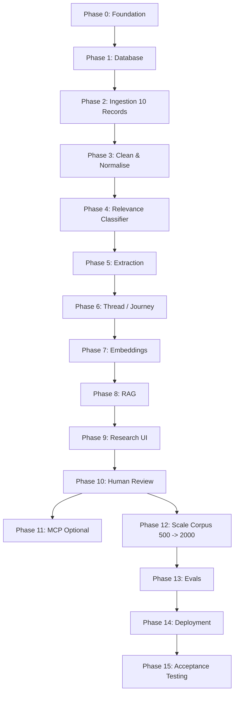

# ImplementationPlan — Finding Memory

**Version:** 1.0  
**Status:** DRAFT — Awaiting human approval before implementation  
**Created:** 2026-10-06  
**Source of truth:** docs/ProblemStatement_Finding_Memory.txt §P, §AV; AntigravityMasterPrompt.txt §R–S, §T

---

## 1. Governing Rules

- Each phase is **independently testable** before the next begins
- No phase is complete until: requirements implemented + tests pass + edge cases checked + security reviewed + documentation updated + PROJECT_STATE.md updated + safe Git checkpoint exists
- Status labels: **IMPLEMENTED — NOT TESTED** / **IMPLEMENTED AND TESTED** / **VERIFIED** / **BLOCKED**
- The 2,000-record target is approached incrementally: prove 10 → 100 → 500 → 2,000+
- Do not attempt to debug an unproven architecture with thousands of records
- Do not merge unrelated phases

---

## 2. Pre-Implementation Gate

**All of the following must be explicitly approved before Phase 0 begins:**

- [ ] docs/ProblemStatement_Finding_Memory.txt (already exists)
- [ ] Architecture.md
- [ ] DataSources.md
- [ ] ResearchSchema.md
- [ ] ImplementationPlan.md
- [ ] Conventions.md
- [ ] EdgeCases.md
- [ ] Evals.md
- [ ] Decisions.md

---

## 3. Phase Overview

| Phase | Name | Antigravity Model Tier | Credentials Needed | Output |
|---|---|---|---|---|
| 0 | Project Foundation | Flash Medium | GitHub (existing or new) | Repo, Next.js scaffold, .gitignore, CI |
| 1 | Database + Research Schema | Flash Medium | Supabase project | Migrations, RLS, seed fixtures |
| 2 | First Real Evidence Ingestion | Flash High | None new | 10 real records end-to-end |
| 3 | Cleaning + Normalization + Deduplication | Flash Medium | None new | Clean corpus; dedup log |
| 4 | Retrieval Relevance Classifier | Flash High | Gemini API key | Classification with gold evals |
| 5 | Structured AI Extraction | Flash High | Gemini API key | Cue/behaviour/journey analysis |
| 6 | Thread / Journey Reconstruction | Flash High | None new | Journey records with evidence |
| 7 | Embeddings + Pattern Clustering | Gemini Pro High | Gemini embedding model | Clusters with inspectable members |
| 8 | RAG + Citations | Gemini Pro High | None new | Cited answers + insufficiency |
| 9 | Research UI | Flash Medium | Vercel account | All 6 core surfaces live |
| 10 | Human Review Workflow | Flash Medium | None new | Annotation, audit trail |
| 11 | Google Docs MCP (optional) | Flash Medium | Google Docs OAuth / MCP | Export flow (if needed) |
| 12 | Scale Corpus toward 2,000+ | Flash High | Source-specific | Verified 2,000+ records |
| 13 | Evaluation + Security Hardening | Sonnet Thinking | None new | Eval report, security review |
| 14 | Deployment | Flash Medium | Vercel production | Live production URL |
| 15 | Reviewer Acceptance Testing | Sonnet Thinking | None new | Acceptance sign-off |

### 3.1 Phase Dependency Graph



> **Antigravity development model routing (per master prompt and user instruction):**
> - Normal coding: Gemini 3.8 Flash Medium
> - Difficult debugging / independent review: Claude Sonnet 4.6 (Thinking)
> - Major architecture / security / RAG review: Gemini 3.1 Pro High
> - Claude Opus 4.6 Thinking: only for exceptional unresolved issues

---

## 4. Phase Details

---

### Phase 0 — Project Foundation

**Goal:** A working repository with scaffold, conventions, and CI that all subsequent phases build on.

**Inputs:** Approved documentation set.  
**Outputs:** GitHub repo, Next.js + TypeScript scaffold, .gitignore, .env.example, GitHub Actions config, basic CI.

**Tasks:**
- [ ] Initialize Git repository in project root
- [ ] Create Next.js + TypeScript application with App Router
- [ ] Configure TypeScript strict mode
- [ ] Add .gitignore (exclude .env, .env.local, node_modules, sensitive exports)
- [ ] Commit .env.example (variable names only)
- [ ] Set up ESLint + Prettier (or biome)
- [ ] Set up basic GitHub Actions workflow (lint + type-check)
- [ ] Create folder structure per Conventions.md
- [ ] Verify `npm run dev` works
- [ ] Create initial PROJECT_STATE.md checkpoint

**Test criteria:**
- [ ] `npm run build` succeeds without errors
- [ ] `npm run lint` passes
- [ ] `npx tsc --noEmit` passes
- [ ] GitHub Actions CI passes on push
- [ ] No secrets in committed files

**Model:** Flash Medium  
**Credentials needed:** GitHub account

---

### Phase 1 — Database + Research Schema

**Goal:** A working Supabase database with all tables from ResearchSchema.md, RLS enabled, migrations tracked, and test fixtures loadable.

**Inputs:** ResearchSchema.md approved.  
**Outputs:** SQL migration files, Supabase connection working, synthetic test fixtures (clearly labelled TEST_FIXTURE_SYNTHETIC=true, never entering real research corpus).

**Tasks:**
- [ ] Create Supabase project (development)
- [ ] Add NEXT_PUBLIC_SUPABASE_URL, NEXT_PUBLIC_SUPABASE_PUBLISHABLE_KEY, SUPABASE_SECRET_KEY to .env.local
- [ ] Write SQL migration 001: Foundational constraints and types
- [ ] Write SQL migration 002: source_registry, collection_batches
- [ ] Write SQL migration 003: threads, thread_messages, raw_evidence
- [ ] Write SQL migration 004: evidence_analysis
- [ ] Write SQL migration 005: research_clusters, cluster_members
- [ ] Write SQL migration 006: human_annotations
- [ ] Write SQL migration 007: analysis_jobs, report_runs
- [ ] Write SQL migration 008: Indexes
- [ ] Write SQL migration 009: RLS policies, grants, and permissions
- [ ] Create immutability constraint / trigger on raw_evidence.original_text
- [ ] Write and run synthetic test fixtures (labelled TEST_FIXTURE_SYNTHETIC=true)
- [ ] Verify all foreign key constraints
- [ ] Write integration tests for schema constraints and RLS

**Test criteria:**
- [ ] All migrations apply cleanly from scratch
- [ ] All foreign key constraints verified
- [ ] RLS prevents unauthenticated writes to raw_evidence
- [ ] Synthetic fixture inserts and reads work
- [ ] original_text cannot be updated after insert (trigger test)
- [ ] original_text cannot be updated after insert (trigger test)

**Model:** Flash Medium  
**Credentials needed:** Supabase account (free tier)

---

### Phase 2 — First Real Evidence Ingestion

**Goal:** Collect **10 real, permitted Google Photos evidence records** from a single approved source, store them in raw_evidence with full provenance, and confirm the schema holds real data correctly.

This is the first vertical slice validation. Start with **manual import** (ManualCSVConnector or ManualJSONConnector) to avoid connector complexity before the schema is proven.

**Inputs:** Phase 1 complete; at least one approved source with 10 qualifying public records identified by researcher.  
**Outputs:** 10 raw_evidence records with source_url, original_text, corpus_type, collection_batch_id, and verification_status.

**Tasks:**
- [ ] Implement ManualCSVConnector and ManualJSONConnector
- [ ] Define canonical RawEvidenceRecord TypeScript interface
- [ ] Implement import validation (Zod schema for required fields)
- [ ] Researcher identifies 10 qualifying public Google Photos Help Community or Play Store review records
- [ ] Researcher provides manual import file (CSV or JSON) with source URLs
- [ ] Import runs; records stored in raw_evidence
- [ ] Implement URL canonicalization (resolve equivalent links; preserve original_url)
- [ ] Implement content fingerprinting (SHA-256 of original_text) for deduplication
- [ ] Implement collection batch logging (collection_batches record per import)
- [ ] Verify all 10 records: source_url not null, original_text not null, corpus_type = USER_EVIDENCE
- [ ] Implement basic duplicate check (same content_fingerprint → flag for review)

**Test criteria:**
- [ ] 10 records in raw_evidence with correct fields
- [ ] Each record has source_url, collection_batch_id, corpus_type, collected_at
- [ ] No record has NULL original_text
- [ ] Duplicate fingerprint detection works on deliberate test duplicate
- [ ] URL canonicalization resolves test equivalent URLs

**Model:** Flash Medium  
**Credentials needed:** None new (researcher provides manual import file)

---

### Phase 3 — Cleaning + Normalization + Deduplication

**Goal:** A cleaning pipeline that processes raw_evidence records into cleaned derivatives, detects duplicates, assigns corpus classification, detects language, and produces a deduplication log.

**Inputs:** Phase 2 complete with 10+ real records.  
**Outputs:** Cleaned analysis derivative fields, deduplication groups, language labels, cleaning log.

**Tasks:**
- [ ] Implement cleaning stage: flag spam, malformed records, empty content
- [ ] Implement near-duplicate detection (similarity check for review; not auto-merge)
- [ ] Implement exact duplicate detection (content_fingerprint + source identity)
- [ ] Assign duplicate_group_id for linked duplicates; mark is_canonical on retained record
- [ ] Implement language detection (library or Gemini Flash)
- [ ] Implement personal identifier minimization flag (review queue for obvious PII)
- [ ] Preserve emojis, negation, uncertainty markers, short accounts — no word-count cutoff
- [ ] Log every cleaning decision with reason
- [ ] Implement URL canonicalization for thread-level vs message-level locators
- [ ] Write unit tests for each cleaning rule

**Test criteria:**
- [ ] Exact duplicate pair: only canonical record in corpus statistics
- [ ] Near-duplicate pair: flagged for review, not auto-merged
- [ ] Short review with retrieval content: not discarded
- [ ] Record with PII: flagged for review, not auto-deleted
- [ ] All 10 real records pass cleaning with correct language labels
- [ ] Cleaning log shows decision for every processed record

**Model:** Flash Medium  
**Credentials needed:** None new

---

### Phase 4 — Retrieval Relevance Classifier

**Goal:** An AI-powered relevance classifier that categorizes each raw_evidence record as MAIN_INCOMPLETE_MEMORY / PRECISE_MEMORY_SYSTEM_FAILURE / CONTEXT_ONLY / EXCLUDED / NEEDS_REVIEW, with rationale and source spans.

This phase introduces the first Gemini API calls. Evaluate against gold-standard examples before scaling.

**Inputs:** Phase 3 complete; Gemini API key configured.  
**Outputs:** Relevance classification for each real record, prompt_v1 defined, initial gold-standard set started.

**Tasks:**
- [ ] Configure GEMINI_API_KEY in .env.local
- [ ] Implement Relevance Classifier prompt (prompt_v1); define TypeScript schema for output
- [ ] Implement Gemini API client with retry/backoff/timeout
- [ ] Implement analysis_jobs record creation and status tracking
- [ ] Run classifier on 10 real records; inspect results
- [ ] Researcher creates first 15 gold-standard examples (manually labelled)
- [ ] Evaluate classifier on gold standard: record precision + recall
- [ ] Refine prompt if needed; log all prompt versions
- [ ] Implement NEEDS_REVIEW queue (low-confidence or ambiguous cases)
- [ ] Implement batch processing (not per-record real-time for large corpora)
- [ ] Unit test classifier output schema validation
- [ ] Security review: prompt injection defence (external text as data, not instruction)

**Test criteria:**
- [ ] Classifier produces valid JSON output for all 10 real records
- [ ] Output includes category, rationale, source_spans
- [ ] Gold-standard precision ≥ 85% (target; report actual)
- [ ] Ambiguous cases land in NEEDS_REVIEW, not silently EXCLUDED
- [ ] Prompt version recorded on every analysis record
- [ ] API failure handled gracefully (retry → job failure with error_summary)
- [ ] No external text executes as instruction

**Model:** Flash High (for classifier implementation); classifier runtime uses Flash Low/Medium  
**Credentials needed:** Gemini API key (GEMINI_API_KEY)

---

### Phase 5 — Structured AI Extraction

**Goal:** A structured extraction pipeline that extracts memory cues, behaviours, outcomes, and initial problem codes for each MAIN_INCOMPLETE_MEMORY record, stored as versioned evidence_analysis records.

**Inputs:** Phase 4 complete; relevance classification done on real records.  
**Outputs:** evidence_analysis records with cues, actions, outcomes, problem_codes for each qualifying record.

**Tasks:**
- [ ] Implement Memory Cue Extraction prompt and output schema
- [ ] Implement Behaviour Extraction prompt and output schema
- [ ] Implement Outcome Classification (FOUND/PARTIAL/FAILED/ABANDONED/NOT_REPORTED/UNCLEAR)
- [ ] Implement initial Problem Coding (starter taxonomy codes)
- [ ] Implement evidence type label enforcement (DIRECT_STATEMENT / STRONGLY_IMPLIED_BEHAVIOUR / AI_INTERPRETATION)
- [ ] Implement FORGOTTEN rule validation (only when explicitly stated)
- [ ] Implement initial_query rule (NULL if not reported; no paraphrasing)
- [ ] Implement workaround attribution rule (OP confirmation required)
- [ ] Store all outputs in evidence_analysis with model_name, prompt_version, analysis_version
- [ ] Evaluate extraction on gold-standard set (cue precision/recall)
- [ ] Refine prompts; update Evals.md with results

**Test criteria:**
- [ ] Cue extraction on 10 real records produces typed cue objects
- [ ] No FORGOTTEN cue without explicit source text evidence
- [ ] initial_query is NULL for 5 known records without explicit query
- [ ] AI_INTERPRETATION label correctly applied to inferred content
- [ ] Problem codes drawn from starter taxonomy only (emergent codes noted separately)
- [ ] All analysis records have analysis_version and prompt_version
- [ ] Gold-standard cue extraction accuracy ≥ 85% (report actual)

**Model:** Flash High (pipeline implementation); runtime uses Flash Medium  
**Credentials needed:** Gemini API key (already configured)

---

### Phase 6 — Thread / Journey Reconstruction

**Goal:** Connect available thread messages into ordered journeys, preserve missing/deleted segments as gaps, link cue evolution to journey steps, and reconstruct conversation context.

**Inputs:** Phase 5 complete; thread records available.  
**Outputs:** threads, thread_messages populated; journey_steps in evidence_analysis for threaded records.

**Tasks:**
- [ ] Implement thread grouping (link raw_evidence records by thread_url)
- [ ] Implement thread_messages ordering (sequence_number by timestamp or reply relationship)
- [ ] Implement speaker labelling (opaque thread-scoped pseudonyms)
- [ ] Implement deleted/unavailable message handling (is_deleted = TRUE, NULL message_text)
- [ ] Implement Journey Reconstruction prompt (extract ordered steps from full thread context)
- [ ] Implement cue evolution extraction (initially_accessible_cues, newly_recalled_cues, cue_evolution_sequence)
- [ ] Implement trigger labelling for new cues (new_cue_trigger)
- [ ] Distinguish OP actions from commenter suggestions (workaround ≠ confirmed unless OP confirms)
- [ ] Implement partial journey handling (gaps remain visible)
- [ ] Run on 10 real threaded records
- [ ] Evaluate journey reconstruction on gold-standard thread examples

**Test criteria:**
- [ ] Thread with 3 messages: all 3 stored with correct sequence_number
- [ ] Deleted message: is_deleted = TRUE, message_text = NULL (no invented content)
- [ ] Suggested workaround without OP confirmation: not labelled as attempted
- [ ] Journey with unknown ordering: gap marked, no invented transitions
- [ ] Speaker labels are thread-scoped and opaque
- [ ] Cue evolution sequence references source spans

**Model:** Flash High  
**Credentials needed:** None new

---

### Phase 7 — Embeddings + Pattern Clustering

**Goal:** Generate embeddings for qualifying evidence records, build a vector index, and produce initial semantic clusters with inspectable members.

**Inputs:** Phase 6 complete; qualifying evidence records available.  
**Outputs:** evidence_embeddings populated; research_clusters with cluster_members; pgvector index active.

**Tasks:**
- [ ] Select embedding model (Gemini text-embedding model; dedicated embedding endpoint only)
- [ ] Implement EmbeddingGenerator: chunk strategy, batch processing
- [ ] Store each embedding with embedding_model, embedding_version, chunk_text, corpus_type
- [ ] Create SQL migration to enable pgvector extension
- [ ] Create SQL migration for evidence_embeddings table and dimensions
- [ ] Create pgvector HNSW or IVFFlat index on evidence_embeddings.embedding_vector
- [ ] Implement semantic clustering (k-means or HDBSCAN; configurable)
- [ ] Implement structured cluster assignment (evidence_analysis.problem_codes co-occurrence)
- [ ] Implement cluster record creation (research_clusters with version, label, definition)
- [ ] Implement cluster_members assignments
- [ ] Implement outlier tracking (ungrouped evidence remains visible)
- [ ] Evaluate cluster quality: inspectable members, source breadth, negative cases

**Test criteria:**
- [ ] All qualifying records have evidence_embeddings entries
- [ ] Every embedding has embedding_model and embedding_version
- [ ] Semantic similarity search returns relevant records for test queries
- [ ] Every cluster has inspectable member evidence_ids via cluster_members
- [ ] Outliers are not forced into a cluster
- [ ] Changing embedding model triggers versioned re-embedding (not silent overwrite)

**Model:** Gemini Pro High (cluster analysis); runtime uses dedicated embedding model  
**Credentials needed:** Gemini embedding model (same API key)

---

### Phase 8 — RAG + Citations

**Goal:** A hybrid RAG system that retrieves eligible evidence, synthesizes a cited answer or returns the explicit insufficiency response, and labels corpus contributions.

**Inputs:** Phase 7 complete; vector index active.  
**Outputs:** Working Ask Research endpoint with claim-level citations and corpus labels.

**Tasks:**
- [ ] Implement query understanding stage (metadata filter extraction + scope)
- [ ] Implement hybrid retrieval: pgvector cosine similarity + PostgreSQL full-text search + metadata filters
- [ ] Implement corpus-type filter enforcement before synthesis
- [ ] Implement candidate ranking and case-level deduplication
- [ ] Implement conversation context retrieval (thread reconstruction for retrieved chunks)
- [ ] Implement evidence-grounded synthesis prompt
- [ ] Implement claim-level citation: evidence_id + source_span + source_url + corpus_type
- [ ] Implement insufficiency response: "Insufficient evidence in the current research corpus."
- [ ] Implement answer paths: examples/qualitative vs counts/rates (SQL for counts)
- [ ] Test on 10 research questions covering: qualitative, quantitative, contradictory, insufficient
- [ ] Evaluate RAG quality per Evals.md
- [ ] Security review: retrieved content cannot instruct the pipeline

**Test criteria:**
- [ ] Qualitative question returns cited answer with evidence_id links
- [ ] Count question uses SQL, not top-k sample
- [ ] Question about missing data returns insufficiency response (not hallucinated answer)
- [ ] PRODUCT_REFERENCE contribution labelled separately from USER_EVIDENCE
- [ ] Citations resolve to retained eligible records
- [ ] No fabricated URLs, quotes, or evidence IDs in any answer
- [ ] Prompt-injection content in retrieved chunks does not affect pipeline behaviour

**Model:** Gemini Pro High (RAG implementation); runtime uses Flash High/Pro for synthesis  
**Credentials needed:** None new

---

### Phase 9 — Research UI

**Goal:** All 6 core UI surfaces live and functional: Overview, Evidence Explorer, Patterns, Retrieval Journeys, Opportunities, Ask Research. Visual analysis implemented.

**Inputs:** Phases 1–8 complete.  
**Outputs:** Deployed Next.js application on Vercel (or local preview); all surfaces load real data from database.

**Tasks:**
- [ ] Implement Overview surface (corpus snapshot, coverage, health indicators, compact visual summary)
- [ ] Implement Evidence Explorer (filters, search, record detail, WHAT USER SAID vs WHAT AI INTERPRETED)
- [ ] Implement Patterns surface (cue co-occurrence heatmap, breakdown bars, affinity theme cards)
- [ ] Implement Retrieval Journeys surface (case-level journey maps, aggregated transitions)
- [ ] Implement Opportunities surface (evidence-backed shortlist with uncertainty preserved)
- [ ] Implement Ask Research surface (research question input, cited answer, insufficiency state)
- [ ] Implement Methods & Limitations surface
- [ ] Implement visual analysis: source/product distribution bars, outcome bars, ranked cues, theme cards, journey map, cue-evolution timeline
- [ ] Implement filter persistence across views
- [ ] Implement drill-down: chart element → contributing cases → evidence detail → source URL
- [ ] Implement accessible design: keyboard navigation, ARIA labels, visible focus, contrast, screen-reader support
- [ ] Handle all error states: loading, empty, unavailable source, failed processing, incomplete citation
- [ ] Connect Vercel account; configure production environment variables

**Test criteria:**
- [ ] All 6 surfaces load without errors on real data
- [ ] Filter changes update displayed records correctly
- [ ] Evidence Explorer shows source text separately from AI interpretation
- [ ] Chart drill-down opens correct contributing cases
- [ ] Empty state shows truthful "no evidence collected" state (not fake data)
- [ ] Insufficient data state displays (not misleading zero chart)
- [ ] Keyboard navigation works on all interactive elements
- [ ] No server secrets in browser network payloads
- [ ] Vercel deployment succeeds; production URL works

**Model:** Flash Medium  
**Credentials needed:** Vercel account (free Hobby)

---

### Phase 10 — Human Review Workflow

**Goal:** A researcher-only annotation workflow that allows approval/rejection of evidence, correction of AI analysis, cluster management, gold-standard creation, and maintains a full audit trail.

**Inputs:** Phase 9 complete.  
**Outputs:** human_annotations table active; researcher can correct analysis and see changes reflected in dependent views.

**Tasks:**
- [ ] Implement access control for researcher-only actions (passphrase or Supabase Auth)
- [ ] Implement evidence eligibility review (approve/reject/needs_review with reason)
- [ ] Implement AI extraction correction (edit evidence_analysis fields; log previous_value, new_value)
- [ ] Implement cluster management (merge, split, rename clusters)
- [ ] Implement contradiction flagging
- [ ] Implement pin / gold-standard designation
- [ ] Implement audit trail view (list of changes for a given evidence_id)
- [ ] Verify correction propagates to dependent views (cluster stats refresh)
- [ ] Verify raw_evidence.original_text cannot be changed through the review UI

**Test criteria:**
- [ ] Researcher corrects a cue state; change appears in Evidence Explorer
- [ ] Audit trail shows previous_value, new_value, reviewer, timestamp
- [ ] original_text unchanged after annotation
- [ ] Cluster merge produces single cluster with all members
- [ ] Gold-standard designation is visible in human_annotations table
- [ ] Unauthenticated user cannot access review actions

**Model:** Flash Medium  
**Credentials needed:** None new

---

### Phase 11 — Google Docs MCP (Optional)

**Goal:** A researcher-triggered export of a selected report to an authorized Google Docs destination via MCP.

**Condition:** Only implement if the main research application is working and the researcher explicitly needs this. The engine must continue to function fully without this integration.

**Inputs:** Phase 10 complete; MCP server configured; researcher has selected report and authorized destination.  
**Outputs:** Report exported to specified Google Docs document; no unrelated content modified.

**Tasks:**
- [ ] Verify available MCP server at MCP_SERVER_URL (do not assume it exists)
- [ ] Authenticate with minimal permissions (document-write only)
- [ ] Implement researcher selection: choose report, confirm destination document
- [ ] Implement export: create or append; do not modify unrelated content
- [ ] Handle partial writes and failures gracefully
- [ ] Verify export contains corpus snapshot, limitations, source links
- [ ] Verify export does not change document sharing permissions
- [ ] No Gmail. No email notifications.

**Test criteria:**
- [ ] Export creates correct content in destination document
- [ ] Application continues to function if MCP server is unavailable
- [ ] Unrelated document content is not modified
- [ ] Failed write is reported clearly to researcher

**Model:** Flash Medium  
**Credentials needed:** Google Docs OAuth / MCP_SERVER_URL (Phase 11 only)

---

### Phase 12 — Scale Corpus toward 2,000+ Verified Records

**Goal:** Scale the proven pipeline to collect, process, and verify ≥ 2,000 unique qualifying USER_EVIDENCE records.

**Inputs:** Phases 1–9 working reliably with 100 records; source access confirmed.  
**Outputs:** Verified corpus meeting the 2,000-record target or a documented honest shortfall.

**Tasks:**
- [ ] Enable approved source connectors (Play Store, App Store, YouTube, manual imports)
- [ ] Enable Reddit connector if approval is obtained; otherwise mark UNAVAILABLE
- [ ] Scale batch processing (configurable batch size, checkpoints, idempotency)
- [ ] Run full ingestion → clean → deduplicate → classify pipeline on growing corpus
- [ ] Monitor analysis_jobs table for failures; surface partial-source failures
- [ ] Add comparison product sources (Apple Photos, Amazon Photos, Samsung, Microsoft, Dropbox)
- [ ] Collect PRODUCT_REFERENCE documents for all relevant products
- [ ] Collect COGNITIVE_REFERENCE literature
- [ ] Run structured AI extraction on all qualifying records
- [ ] Refresh embeddings and clusters for new records
- [ ] Report collection waterfall: collected / unique / deduplicated / classified / verified / qualifying / shortfall
- [ ] Human review priority: ambiguous eligibility, low-confidence extraction, important findings

**Test criteria:**
- [ ] Collection waterfall report is accurate and auditable
- [ ] Duplicate detection works at scale (content_fingerprint + source_id check)
- [ ] Cluster membership remains inspectable at scale
- [ ] No records with fabricated source_url or invented original_text
- [ ] Reddit marked UNAVAILABLE if approval is not obtained
- [ ] 2,000-record shortfall (if any) reported honestly

**Model:** Flash High  
**Credentials needed:** Source-specific (YouTube API key, Apify token if needed, Reddit if approved)

---

### Phase 13 — Evaluation + Security Hardening

**Goal:** Formal evaluation against gold-standard set; security review of all system layers; performance profiling.

**Inputs:** Phase 12 complete or substantially in progress.  
**Outputs:** Evals.md updated with actual results; KNOWN_ISSUES.md updated; security findings resolved.

**Tasks:**
- [ ] Complete gold-standard set to 150 examples (stratified; 30 independently double-coded)
- [ ] Run held-out evaluation: relevance precision/recall, cue extraction accuracy, outcome accuracy
- [ ] Run RAG evaluation: 50 held-out research questions; citation accuracy; insufficiency handling
- [ ] Verify all citations resolve to retained eligible records (0 fabricated citations)
- [ ] Security review: database RLS, client bundle, CORS headers, server secrets, logs
- [ ] Security review: prompt injection defence (adversarial input tests)
- [ ] Security review: URL ingestion (SSRF tests)
- [ ] Security review: input validation (malformed inputs, long strings, injection attempts)
- [ ] Performance review: no N+1 queries, no full-table scans for common paths
- [ ] Fix all material security and quality issues

**Test criteria:**
- [ ] Relevance precision ≥ 90% (report actual)
- [ ] Relevance recall ≥ 80% (report actual)
- [ ] Cue/action/outcome accuracy ≥ 90% (report actual)
- [ ] RAG supported answer accuracy ≥ 95% (report actual)
- [ ] Insufficiency handling accuracy ≥ 90% (report actual)
- [ ] Zero fabricated citations in held-out set
- [ ] No server secrets in browser bundle
- [ ] Adversarial prompt injection does not alter pipeline behaviour

**Model:** Claude Sonnet 4.6 Thinking (evaluation methodology + security review)  
**Credentials needed:** None new

---

### Phase 14 — Deployment

**Goal:** A production-ready deployment on Vercel with all environment variables configured, security headers set, and a passing production smoke test.

**Inputs:** Phase 13 complete.  
**Outputs:** Live production URL; passing smoke test; README.md complete.

**Tasks:**
- [ ] Configure Vercel production environment variables (never in client bundle)
- [ ] Run production build: `npm run build` succeeds
- [ ] Run full lint, type-check, unit tests, integration tests, critical E2E tests
- [ ] Configure security headers (CSP, HSTS, X-Frame-Options, etc.)
- [ ] Configure CORS to production origin only
- [ ] Configure Supabase production project (separate from development)
- [ ] Run production migrations
- [ ] Deploy to Vercel
- [ ] Production smoke test: all surfaces, filters, citations, insufficiency state, mobile
- [ ] Write README.md (no secrets; all sections per master prompt §CL)

**Test criteria:**
- [ ] Production URL loads Overview with real corpus data
- [ ] Evidence Explorer filters work
- [ ] Source URL links resolve
- [ ] Ask Research returns cited answer on a valid question
- [ ] Insufficiency response returned for unanswerable question
- [ ] No server secrets in browser DevTools network tab
- [ ] Mobile layout is usable

**Model:** Flash Medium  
**Credentials needed:** Vercel production environment variables configured

---

### Phase 15 — Reviewer Acceptance Testing

**Goal:** Independent review by a PM, UX researcher, or graduation project reviewer confirming the product meets the Definition of Done from docs/ProblemStatement_Finding_Memory.txt §AX.

**Inputs:** Phase 14 deployed.  
**Outputs:** Acceptance sign-off; documented unmet criteria (if any); final Decisions.md update.

**Tasks:**
- [ ] Reviewer walks through all 20 Definition of Done items (§AX)
- [ ] Verify: every important finding traces to evidence IDs and source URLs
- [ ] Verify: researcher can correct an interpretation and see change reflected
- [ ] Verify: visual analysis charts have correct denominators and drill-down
- [ ] Verify: unmet criteria (e.g., volume shortfall) are visible and documented
- [ ] Final multi-role review (PM / UX Researcher / AI Expert / Security / QA)

**Test criteria:**
- [ ] All 20 Definition of Done items assessed (pass / partial / fail recorded)
- [ ] Evaluation results are visible in the UI
- [ ] No live link, raw record count, or polished interface substitutes for unmet criteria

**Model:** Claude Sonnet 4.6 Thinking (final architecture and quality review)  
**Credentials needed:** None new

---

## 5. Vertical Slice Milestone (Between Phase 2 and Phase 3)

This is the critical checkpoint before scaling. Prove this flow works completely before collecting more data:

```
10 real Google Photos records (manual import)
→ raw_evidence stored with provenance
→ cleaned and normalized
→ deduplication checked
→ relevance classified (at least 3 MAIN_INCOMPLETE_MEMORY)
→ cues + behaviour extracted
→ evidence_analysis record with version metadata
→ Evidence Explorer shows records
→ RAG query returns cited answer from at least 1 record
→ Citation links to source_url
→ Source URL opens in browser
```

Only after this is verified should the corpus scale to 100 → 500 → 2,000.

---

## 6. Credential Timing

| Phase | Credential |
|---|---|
| Phase 0 | GitHub account |
| Phase 1 | Supabase project (free) |
| Phase 4 | GEMINI_API_KEY (Google AI Studio) |
| Phase 9 | Vercel account (free Hobby) |
| Phase 12 | YOUTUBE_API_KEY (when YouTube connector phase begins) |
| Phase 12 | REDDIT_CLIENT_ID / SECRET (only if research approval obtained) |
| Phase 12 | APIFY_API_TOKEN (only if needed for compliant collection) |
| Phase 11 | MCP_SERVER_URL + Google Docs OAuth (optional; Phase 11 only) |

Do not ask the user to create all accounts on day one.
