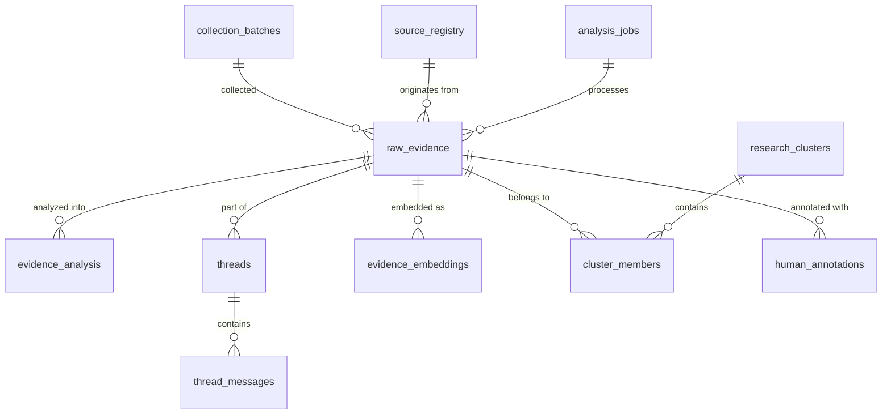

# ResearchSchema — Finding Memory

**Version:** 1.0  
**Status:** DRAFT — Awaiting human approval before implementation  
**Created:** 2026-10-06  
**Source of truth:** docs/ProblemStatement_Finding_Memory.txt §U–V, §X, §AB–§AC; Architecture.md §7

---

## 1. Design Principles

1. **Raw evidence is immutable.** Source content is never overwritten by AI analysis or human annotation.
2. **Analysis is versioned.** Every AI output carries model_name, prompt_version, analysis_version, and analysed_at.
3. **Evidence type labels are mandatory.** Every claim carries DIRECT_STATEMENT / STRONGLY_IMPLIED_BEHAVIOUR / AI_INTERPRETATION / RESEARCH_HYPOTHESIS.
4. **Corpus separation is enforced at the schema level.** corpus_type is a required field on raw_evidence.
5. **Unknowns stay visible.** Missing values are explicit NULL or a named "unknown" enumeration value — never fabricated.
6. **Deduplication is tracked, not destructive.** Duplicate records are linked by duplicate_group_id; the canonical record is retained.
7. **Human review is auditable.** Every annotation change records reviewer, previous value, new value, reason, and timestamp.
8. **This is an information model, not a migration file.** Column definitions are logical requirements.
9. **UUID Strategy:** Use `gen_random_uuid()` for all UUID primary keys. Do not use legacy UUID extensions (e.g., uuid-ossp).
10. **Controlled Values:** Research taxonomies use evolvable `TEXT` columns with `CHECK` constraints (denoted as `TEXT (CHECK)`) rather than rigid native PostgreSQL ENUMs.

---

## 2. Table Overview

| Table | Group | Purpose |
|---|---|---|
| source_registry | Operations | Tracks every candidate data source: platform, corpus, access status, terms |
| collection_batches | Operations | One record per ingestion run; links to raw_evidence records |
| raw_evidence | Evidence (raw) | Immutable source captures — the single source of truth for what was collected |
| threads | Evidence (raw) | Groups related messages from threaded discussions |
| thread_messages | Evidence (raw) | Individual messages within a thread; ordered by sequence |
| evidence_analysis | Evidence (analysis) | Versioned AI analysis linked to raw_evidence — never overwrites raw |
| evidence_embeddings | Embeddings | Vector representations linked to raw_evidence or evidence_analysis chunks |
| research_clusters | Patterns | Semantic and structured groupings of evidence; versioned |
| cluster_members | Patterns | Many-to-many: research_clusters ↔ raw_evidence |
| human_annotations | Annotation | Researcher corrections, approvals, rejections, notes; full audit trail |
| analysis_jobs | Operations | Background job tracking for ingestion and analysis runs |
| report_runs | Operations | Research report generation runs with corpus snapshot metadata |

### 2.1 Entity Relationship Diagram



---

## 3. source_registry

Tracks every candidate data source before and during active collection.

| Column | Type | Required | Description |
|---|---|---|---|
| source_id | UUID | YES | Stable system identifier |
| source_platform | TEXT | YES | Platform label (google_play_store, apple_app_store, reddit, youtube, etc.) |
| corpus_type | TEXT (CHECK) | YES | USER_EVIDENCE / PRODUCT_REFERENCE / COGNITIVE_REFERENCE |
| display_name | TEXT | YES | Human-readable name |
| priority | INTEGER | NO | Collection priority relative to other sources |
| access_status | TEXT (CHECK) | YES | ENABLED / CONDITIONAL / UNAVAILABLE / MANUAL_ONLY / NOT_VERIFIED |
| permitted_route | TEXT | YES | Description of the confirmed or proposed collection method |
| terms_reference_url | TEXT | NO | URL of applicable terms or policy |
| approval_status | TEXT | NO | Description of research-access approval state |
| approval_date | TIMESTAMPTZ | NO | Date access was confirmed |
| ai_processing_permitted | BOOLEAN | NO | Whether AI analysis of this source's content is explicitly allowed |
| display_conditions | TEXT | NO | What content can be shown publicly vs researcher-only |
| rate_limits | TEXT | NO | Known rate or quota limits |
| retention_conditions | TEXT | NO | Source-specific retention and deletion requirements |
| last_checked_at | TIMESTAMPTZ | NO | When terms/access status was last verified |
| notes | TEXT | NO | Any additional conditions or caveats |
| created_at | TIMESTAMPTZ | YES | Record creation timestamp |
| updated_at | TIMESTAMPTZ | YES | Last update timestamp |

---

## 4. collection_batches

One record per ingestion run. Links to raw_evidence records via collection_batch_id.

| Column | Type | Required | Description |
|---|---|---|---|
| batch_id | UUID | YES | Stable batch identifier |
| source_id | UUID | YES | FK → source_registry.source_id |
| corpus_type | TEXT (CHECK) | YES | Corpus this batch contributes to |
| collection_method | TEXT | YES | Connector class / method used |
| started_at | TIMESTAMPTZ | YES | Run start time |
| completed_at | TIMESTAMPTZ | NO | Run completion time (NULL if running or failed) |
| status | TEXT (CHECK) | YES | PENDING / RUNNING / PARTIAL / FAILED / COMPLETE |
| records_fetched | INTEGER | NO | Total records retrieved from source |
| records_stored | INTEGER | NO | Records written to raw_evidence |
| records_duplicate | INTEGER | NO | Records identified as duplicates |
| records_failed | INTEGER | NO | Records that could not be stored |
| error_summary | TEXT | NO | Description of errors encountered |
| config_snapshot | JSONB | NO | Non-secret configuration used for this run |
| checkpoint_state | JSONB | NO | Pagination/resume state for incremental collection |
| date_window_start | DATE | NO | Earliest publication date requested |
| date_window_end | DATE | NO | Latest publication date requested |
| created_at | TIMESTAMPTZ | YES | Record creation timestamp |

---

## 5. raw_evidence

**Immutable source captures.** This table must never be updated by AI analysis. Human review may add a withdrawal flag but may not alter original_text.

| Column | Type | Required | Description |
|---|---|---|---|
| evidence_id | UUID | YES | Stable system identifier |
| corpus_type | TEXT (CHECK) | YES | USER_EVIDENCE / PRODUCT_REFERENCE / COGNITIVE_REFERENCE |
| source_platform | TEXT | YES | Platform label |
| source_type | TEXT | YES | review / community_post / youtube_comment / reddit_post / reddit_comment / manual_import / academic / web_page / etc. |
| product_name | TEXT | NO | Named product (Google Photos, Apple Photos, etc.) |
| product_id | TEXT | NO | Store package ID or product identifier |
| source_record_id | TEXT | NO | Source-platform-specific unique ID (review_id, comment_id, etc.) |
| source_url | TEXT | YES | Canonical source locator |
| original_url | TEXT | NO | Pre-canonicalization URL |
| parent_thread_url | TEXT | NO | Thread-level URL for discussion posts |
| thread_id | UUID | NO | FK → threads.thread_id |
| parent_message_id | UUID | NO | FK → thread_messages.message_id (for replies) |
| sequence_in_thread | INTEGER | NO | Position within thread (1 = original post) |
| title | TEXT | NO | Review title, thread title, or document title |
| original_text | TEXT | YES | Source content exactly as collected; never modified |
| language | TEXT | NO | Detected language code (ISO 639-1) |
| country_market | TEXT | NO | Country/region metadata from source (not author nationality) |
| rating | NUMERIC | NO | Star rating or score where available |
| helpful_score | INTEGER | NO | Source helpfulness count (metadata only; not a validity measure) |
| published_at | TIMESTAMPTZ | NO | Publication timestamp (preserved precision) |
| collected_at | TIMESTAMPTZ | YES | When this record was collected |
| collection_method | TEXT | YES | Connector class used |
| collection_batch_id | UUID | YES | FK → collection_batches.batch_id |
| verification_status | TEXT (CHECK) | YES | UNVERIFIED / SOURCE_VERIFIED / HUMAN_REVIEWED |
| source_access_notes | TEXT | NO | Conditions on display, reuse, or AI processing |
| content_fingerprint | TEXT | NO | Hash of original_text for deduplication |
| duplicate_group_id | UUID | NO | Links duplicate records; NULL if no known duplicate |
| is_canonical | BOOLEAN | NO | TRUE if this is the retained record in a duplicate group |
| duplicate_reason | TEXT | NO | Rationale for merging (e.g., exact hash, url match) |
| withdrawn | BOOLEAN | NO | TRUE if source deletion or privacy withdrawal required |
| withdrawn_at | TIMESTAMPTZ | NO | When withdrawal was applied |
| withdrawal_reason | TEXT | NO | Required privacy/source deletion reason |
| created_at | TIMESTAMPTZ | YES | DB insert timestamp |

**Deduplication behaviour:** Duplicate records are linked by duplicate_group_id. The canonical record is marked is_canonical = TRUE. Statistics operate on canonical records only. Near-duplicates are flagged for review, not auto-merged.

---

## 6. threads

Groups related messages from community discussions, help forums, and comment threads.

| Column | Type | Required | Description |
|---|---|---|---|
| thread_id | UUID | YES | Stable thread identifier |
| source_platform | TEXT | YES | Platform label |
| thread_url | TEXT | YES | Canonical thread URL |
| title | TEXT | NO | Thread title |
| product_name | TEXT | NO | Primary product discussed |
| message_count | INTEGER | NO | Known message count (may be partial if thread is truncated) |
| is_complete | BOOLEAN | NO | FALSE if thread is known to be truncated or unavailable |
| missing_coverage_note | TEXT | NO | Description of what is missing or truncated |
| earliest_message_at | TIMESTAMPTZ | NO | Timestamp of earliest captured message |
| latest_message_at | TIMESTAMPTZ | NO | Timestamp of latest captured message |
| corpus_type | TEXT (CHECK) | YES | Which corpus this thread contributes to |
| collection_batch_id | UUID | NO | FK → collection_batches.batch_id |
| created_at | TIMESTAMPTZ | YES | DB insert timestamp |

---

## 7. thread_messages

Individual messages within a thread, ordered by sequence.

| Column | Type | Required | Description |
|---|---|---|---|
| message_id | UUID | YES | Stable message identifier |
| thread_id | UUID | YES | FK → threads.thread_id |
| evidence_id | UUID | NO | FK → raw_evidence.evidence_id (if stored as raw evidence) |
| sequence_number | INTEGER | YES | Position in thread (1 = original post) |
| parent_message_id | UUID | NO | Reply-to relationship |
| speaker_type | TEXT (CHECK) | NO | OP / RESPONDER / MODERATOR / DEVELOPER / UNKNOWN |
| speaker_label | TEXT | NO | Opaque pseudonym scoped to this thread (e.g., "thread_user_A") |
| message_role | TEXT (CHECK) | NO | ORIGINAL_POST / OP_FOLLOWUP / OTHER_USER_COMMENT / SUGGESTED_WORKAROUND / OUTCOME_UPDATE / REVIEW |
| message_text | TEXT | NO | Message content (may be NULL if message is deleted/unavailable) |
| is_deleted | BOOLEAN | NO | TRUE if message was deleted or unavailable at collection time |
| published_at | TIMESTAMPTZ | NO | Message timestamp |
| created_at | TIMESTAMPTZ | YES | DB insert timestamp |

**Rules:**
- Do not flatten multiple speakers into one journey
- Speaker labels are opaque and thread-scoped; do not link identities across threads or platforms
- deleted/missing messages must be marked is_deleted = TRUE with message_text = NULL; do not invent content

---

## 8. evidence_analysis

**Versioned AI analysis.** Linked to raw_evidence but never overwrites it. Multiple analysis versions may exist for the same evidence_id.

### 8.1 Identity and Audit

| Column | Type | Required | Description |
|---|---|---|---|
| analysis_id | UUID | YES | Stable analysis record identifier |
| evidence_id | UUID | YES | FK → raw_evidence.evidence_id |
| analysis_version | TEXT | YES | Semantic version of the analysis pipeline |
| model_name | TEXT | YES | AI model used for this analysis |
| analysis_prompt_version | TEXT | YES | Prompt template version used |
| analysed_at | TIMESTAMPTZ | YES | When analysis was generated |
| processing_status | TEXT (CHECK) | YES | PENDING / RUNNING / COMPLETE / FAILED / REJECTED_BY_HUMAN |
| human_review_status | TEXT (CHECK) | NO | UNREVIEWED / APPROVED / REJECTED / CORRECTED |
| reviewed_by | TEXT | NO | Reviewer identifier |
| reviewed_at | TIMESTAMPTZ | NO | Review timestamp |

### 8.2 Scope

| Column | Type | Required | Description |
|---|---|---|---|
| retrieval_relevance | TEXT (CHECK) | NO | Relevance tier: HIGH / MEDIUM / LOW / IRRELEVANT |
| relevance_category | TEXT (CHECK) | NO | Retrieval case type: MAIN_INCOMPLETE_MEMORY / PRECISE_MEMORY_SYSTEM_FAILURE / CONTEXT_ONLY / EXCLUDED / NEEDS_REVIEW |
| relevance_score | NUMERIC | NO | Quantitative relevance score where evaluated |
| relevance_rationale | TEXT | NO | Explanation of relevance decision |
| relevance_source_spans | JSONB | NO | Array of text spans supporting relevance decision |
| target_media_type | TEXT[] | NO | photo / video / screenshot / document / other |
| what_user_wanted_to_find | TEXT | NO | Brief description (AI-interpreted; labelled as AI_INTERPRETATION) |
| user_believes_item_exists | BOOLEAN | NO | Whether source indicates user belief that item exists |

### 8.3 Memory Cues

| Column | Type | Required | Description |
|---|---|---|---|
| cues | JSONB | NO | Array of cue objects; see Cue Object definition below |

**Cue Object:**

```json
{
  "cue_id": "uuid",
  "cue_type": "person | time_approximate | time_exact | life_period | event | location | object | clothing | colour | background | action | emotion | weather | season | occasion | who_took_it | app_source | purpose_saved | before_after_context | visible_text | event_sequence | conversation_context | device | media_format | visual_layout | reference_image | other",
  "source_wording": "exact text from source",
  "normalised_description": "standardised summary (AI-interpreted)",
  "source_span": "character offset or quoted excerpt",
  "speaker_label": "thread-scoped speaker label",
  "journey_position": "start | during | end | unknown",
  "cue_state": "CONFIDENT | APPROXIMATE | UNCERTAIN | POSSIBLY_WRONG | CONTRADICTORY | FORGOTTEN | NEWLY_RECALLED",
  "cue_origin": "initial | trigger-based",
  "evidence_label": "DIRECT_STATEMENT | STRONGLY_IMPLIED_BEHAVIOUR | AI_INTERPRETATION",
  "notes": "any additional context"
}
```

**Rules:**
- FORGOTTEN requires an explicit inability-to-remember statement in the source
- Not mentioned ≠ FORGOTTEN; unmentioned cues never qualify
- Do not turn an approximate year into a precise date
- Do not infer demographic or sensitive attributes from cues

### 8.4 Actions and Behaviour

| Column | Type | Required | Description |
|---|---|---|---|
| initial_query | TEXT | NO | Reported actual query text; NULL if "not reported" |
| initial_query_label | TEXT (CHECK) | NO | DIRECT_STATEMENT / NOT_REPORTED / AI_INTERPRETATION |
| search_strategy | TEXT | NO | Described search approach |
| subsequent_actions | JSONB | NO | Array of action objects (see below) |
| workaround | TEXT | NO | Confirmed attempted workaround (requires OP confirmation) |
| workaround_label | TEXT (CHECK) | NO | DIRECT_STATEMENT / STRONGLY_IMPLIED_BEHAVIOUR |

**Action Object:**

```json
{
  "action_id": "uuid",
  "action_type": "search | browse | filter | switch_app | switch_account | switch_device | external_search | ask_person | use_workaround | other",
  "description": "what was done",
  "query_text": "actual query if reported",
  "step_order": 1,
  "system_response": "what the system returned, if reported",
  "evidence_label": "DIRECT_STATEMENT | STRONGLY_IMPLIED_BEHAVIOUR | AI_INTERPRETATION",
  "source_span": "supporting text"
}
```

### 8.5 Cue Evolution

| Column | Type | Required | Description |
|---|---|---|---|
| initially_accessible_cues | UUID[] | NO | Cue IDs available at the start of the attempt (reported) |
| newly_recalled_cues | UUID[] | NO | Cue IDs that emerged later |
| cue_evolution_sequence | JSONB | NO | Ordered cue changes with source span references |
| new_cue_trigger | TEXT | NO | Reported trigger for a newly recalled or revised cue |
| did_recognition_trigger_recall | TEXT (CHECK) | NO | YES / NO / UNKNOWN |
| recognition_trigger_evidence_label | TEXT (CHECK) | NO | DIRECT_STATEMENT / STRONGLY_IMPLIED_BEHAVIOUR / AI_INTERPRETATION |
| external_cue_trigger | TEXT | NO | Trigger outside current search results (if reported) |

### 8.6 Retrieval Journey

| Column | Type | Required | Description |
|---|---|---|---|
| journey_steps | JSONB | NO | Array of journey step objects (action + cue + ordering certainty) |
| journey_completeness | TEXT (CHECK) | NO | COMPLETE / PARTIAL / SINGLE_STEP / UNKNOWN |
| retrieval_outcome | TEXT (CHECK) | NO | FOUND / PARTIAL / FAILED / ABANDONED / NOT_REPORTED / UNCLEAR |
| outcome_label | TEXT (CHECK) | NO | DIRECT_STATEMENT / STRONGLY_IMPLIED_BEHAVIOUR / AI_INTERPRETATION |
| outcome_notes | TEXT | NO | Evidence basis for outcome classification |

**Outcome rules:**
- No reply = NOT_REPORTED (not FAILED)
- Finding the correct event ≠ finding the exact photo
- Later success updates via human_annotations (versioned), preserving earlier failed stages

### 8.7 Problem Coding

| Column | Type | Required | Description |
|---|---|---|---|
| failure_point | TEXT | NO | Where retrieval broke down (observed symptom) |
| problem_codes | TEXT[] | NO | Applied taxonomy codes (versioned codebook) |
| problem_code_version | TEXT | NO | Codebook version used |
| root_cause_hypothesis | TEXT | NO | Possible explanation requiring additional validation |
| root_cause_evidence_label | TEXT (CHECK) | NO | AI_INTERPRETATION / RESEARCH_HYPOTHESIS |

**Taxonomy starter codes (provisional):** memory_limitation, query_articulation_difficulty, visual_to_verbal_gap, query_understanding_failure, metadata_mismatch, indexing_tagging_failure, ocr_failure, person_recognition_gap, ranking_failure, incomplete_result_set, similar_results_overload, date_uncertainty, location_uncertainty, source_account_uncertainty, cross_platform_fragmentation, browsing_navigation_overload, combined, unknown.

Codes are emergent; researchers may add or revise. Codebook changes must be versioned. Multiple codes per record are allowed (disclose in percentages).

### 8.8 Reported Impact

| Column | Type | Required | Description |
|---|---|---|---|
| effort_signal | TEXT | NO | Qualitative description of reported effort (adjectives, etc.) |
| effort_numeric | NUMERIC | NO | Duration in minutes or attempt count only if explicitly reported |
| severity_signal | TEXT | NO | Qualitative severity expression |
| effort_label | TEXT (CHECK) | NO | DIRECT_STATEMENT / AI_INTERPRETATION |

**Rules:** Exact minutes or counts entered only when explicitly supported. Negative sentiment and low ratings do not automatically indicate severe retrieval harm.

### 8.9 Support and Uncertainty

| Column | Type | Required | Description |
|---|---|---|---|
| confidence | TEXT (CHECK) | NO | HIGH / MEDIUM / LOW (plain labels, not numeric probabilities) |
| confidence_basis | TEXT | NO | Explanation of confidence assessment |
| alternative_interpretations | TEXT | NO | Other plausible readings of the evidence |
| extraction_rationale | TEXT | NO | Why this analysis concluded what it did |

---

## 9. evidence_embeddings (DEFERRED TO PHASE 7)

Vector representations. Each record links to either a raw_evidence record or a specific chunk of an evidence_analysis record. Implementation and pgvector extension are deferred to Phase 7 when an embedding model is selected.

| Column | Type | Required | Description |
|---|---|---|---|
| embedding_id | UUID | YES | Stable identifier |
| evidence_id | UUID | YES | FK → raw_evidence.evidence_id |
| analysis_id | UUID | NO | FK → evidence_analysis.analysis_id (if embedding is of analysis content) |
| chunk_index | INTEGER | NO | Chunk number if evidence is split into multiple embeddings |
| chunk_text | TEXT | NO | The text that was embedded |
| embedding_vector | vector | YES | pgvector vector (dimension to be set when model is chosen) |
| embedding_model | TEXT | YES | Model name and version |
| embedding_version | TEXT | YES | Pipeline embedding version |
| corpus_type | TEXT (CHECK) | YES | Corpus of the source record |
| created_at | TIMESTAMPTZ | YES | When embedding was generated |

**Rules:**
- Do not regenerate embeddings unless source text changed, model changed, or explicit migration occurs
- Store embedding_model and embedding_version with every record
- Embeddings must never be used as additional evidence records

---

## 10. research_clusters

Semantic and structured groupings of evidence. Versioned; researcher-editable.

| Column | Type | Required | Description |
|---|---|---|---|
| cluster_id | UUID | YES | Stable cluster identifier |
| cluster_label | TEXT | YES | Human-readable descriptive label |
| cluster_definition | TEXT | NO | Inclusion boundary and what the cluster represents |
| exclusion_boundary | TEXT | NO | What this cluster does not include |
| cluster_type | TEXT (CHECK) | NO | SEMANTIC / STRUCTURED / HYBRID |
| cluster_version | TEXT | YES | Version of the cluster (changes when membership or definition changes) |
| codebook_version | TEXT | NO | Problem-coding codebook version if applicable |
| member_count | INTEGER | NO | Computed distinct evidence count |
| source_breadth | INTEGER | NO | Count of distinct source platforms represented |
| product_breadth | INTEGER | NO | Count of distinct products represented |
| review_status | TEXT (CHECK) | NO | PROVISIONAL / REVIEWED / APPROVED / DEPRECATED |
| reviewed_by | TEXT | NO | Reviewer identifier |
| reviewed_at | TIMESTAMPTZ | NO | Review timestamp |
| notes | TEXT | NO | Analyst notes |
| created_at | TIMESTAMPTZ | YES | Creation timestamp |
| updated_at | TIMESTAMPTZ | YES | Last update timestamp |

**Rules:**
- Every cluster must retain inspectable member evidence_ids (via cluster_members)
- Clusters may overlap; overlap must be disclosed in analysis
- Cluster changes must be versioned; significant membership changes invalidate dependent summaries until refreshed
- No cluster may appear as a confirmed finding without inspectable members

---

## 11. cluster_members

Many-to-many relationship between research_clusters and raw_evidence.

| Column | Type | Required | Description |
|---|---|---|---|
| cluster_id | UUID | YES | FK → research_clusters.cluster_id |
| evidence_id | UUID | YES | FK → raw_evidence.evidence_id |
| membership_type | TEXT (CHECK) | NO | CORE / PERIPHERAL / OUTLIER |
| membership_basis | TEXT | NO | Why this record was included (semantic similarity, structured code, manual) |
| assigned_at | TIMESTAMPTZ | YES | When membership was assigned |
| assigned_by | TEXT | NO | Process or reviewer identifier |

---

## 12. human_annotations

Full audit trail for all researcher actions. Source wording in raw_evidence must never be changed through this table; only annotations and AI-produced interpretations may be corrected.

| Column | Type | Required | Description |
|---|---|---|---|
| annotation_id | UUID | YES | Stable identifier |
| evidence_id | UUID | YES | FK → raw_evidence.evidence_id |
| analysis_id | UUID | NO | FK → evidence_analysis.analysis_id (if annotating AI analysis) |
| cluster_id | UUID | NO | FK → research_clusters.cluster_id (if annotating a cluster) |
| annotation_type | TEXT (CHECK) | YES | ELIGIBILITY_REVIEW / EXTRACTION_CORRECTION / OUTCOME_CORRECTION / CLUSTER_REVIEW / GOLD_STANDARD / EXCLUSION / CONTRADICTION_FLAG / PIN / NOTE |
| previous_value | TEXT | NO | Value before correction |
| new_value | TEXT | NO | Value after correction |
| reason | TEXT | NO | Explanation for the change |
| reviewer | TEXT | YES | Reviewer identifier |
| reviewed_at | TIMESTAMPTZ | YES | Review timestamp |
| is_gold_standard | BOOLEAN | NO | TRUE if this record is designated as a gold-standard evaluation example |
| gold_standard_label | TEXT | NO | Expected correct answer for evaluation use |
| notes | TEXT | NO | Additional context |

**Rules:**
- Ordinary review cannot change raw_evidence.original_text
- Corrections change evidence_analysis annotations
- Required withdrawals may set raw_evidence.withdrawn = TRUE with a reason
- Human-corrected gold-standard examples must be held out from prompt-development use

---

## 13. analysis_jobs

Background job tracking for ingestion, analysis, and embedding runs.

| Column | Type | Required | Description |
|---|---|---|---|
| job_id | UUID | YES | Stable job identifier |
| batch_id | UUID | NO | FK → collection_batches.batch_id |
| job_type | TEXT | YES | INGESTION / RELEVANCE_CLASSIFICATION / CUE_EXTRACTION / BEHAVIOUR_EXTRACTION / JOURNEY_RECONSTRUCTION / PROBLEM_CODING / EMBEDDING / CLUSTERING / VALIDATION / REPORT_GENERATION |
| status | TEXT (CHECK) | YES | PENDING / RUNNING / PARTIAL / FAILED / COMPLETE |
| total_records | INTEGER | NO | Total records to process |
| processed_records | INTEGER | NO | Records processed so far |
| failed_records | INTEGER | NO | Records that failed processing |
| error_summary | TEXT | NO | Error description |
| retry_count | INTEGER | NO | Number of times this job was retried |
| model_name | TEXT | NO | AI model used (if applicable) |
| prompt_version | TEXT | NO | Prompt template version (if applicable) |
| started_at | TIMESTAMPTZ | NO | Job start time |
| completed_at | TIMESTAMPTZ | NO | Job completion time |
| created_at | TIMESTAMPTZ | YES | Record creation time |

---

## 14. report_runs

Research report generation metadata. Reports link findings to the corpus snapshot that produced them.

| Column | Type | Required | Description |
|---|---|---|---|
| report_id | UUID | YES | Stable report identifier |
| report_type | TEXT | YES | OVERVIEW / OPPORTUNITY_ANALYSIS / RESEARCH_SYNTHESIS / CUSTOM |
| research_question | TEXT | NO | Specific question prompting the report |
| corpus_snapshot_date | TIMESTAMPTZ | YES | Date the corpus was snapshotted for this report |
| analysis_version | TEXT | YES | Analysis pipeline version used |
| total_eligible_records | INTEGER | YES | Qualifying corpus N at time of report |
| filters_applied | JSONB | NO | Filters used to scope the report |
| status | TEXT (CHECK) | YES | GENERATING / COMPLETE / FAILED |
| generated_at | TIMESTAMPTZ | NO | Completion timestamp |
| generated_by | TEXT | NO | System or researcher identifier |
| output_location | TEXT | NO | File path or URL of generated report |
| export_target | TEXT | NO | Google Docs document ID (Phase 11 only) |
| notes | TEXT | NO | Any limitations or caveats about this report |

---

## 15. Enum Reference

### corpus_type
USER_EVIDENCE | PRODUCT_REFERENCE | COGNITIVE_REFERENCE

### retrieval_relevance
HIGH | MEDIUM | LOW | IRRELEVANT

### relevance_category
MAIN_INCOMPLETE_MEMORY | PRECISE_MEMORY_SYSTEM_FAILURE | CONTEXT_ONLY | EXCLUDED | NEEDS_REVIEW

### cue_state
CONFIDENT | APPROXIMATE | UNCERTAIN | POSSIBLY_WRONG | CONTRADICTORY | FORGOTTEN | NEWLY_RECALLED

### retrieval_outcome
FOUND | PARTIAL | FAILED | ABANDONED | NOT_REPORTED | UNCLEAR

### evidence_label
DIRECT_STATEMENT | STRONGLY_IMPLIED_BEHAVIOUR | AI_INTERPRETATION | RESEARCH_HYPOTHESIS

### verification_status
UNVERIFIED | SOURCE_VERIFIED | HUMAN_REVIEWED

### access_status
ENABLED | CONDITIONAL | UNAVAILABLE | MANUAL_ONLY | NOT_VERIFIED

### job_status / batch_status
PENDING | RUNNING | PARTIAL | FAILED | COMPLETE

### human_review_status
UNREVIEWED | APPROVED | REJECTED | CORRECTED

### message_role
ORIGINAL_POST | OP_FOLLOWUP | OTHER_USER_COMMENT | SUGGESTED_WORKAROUND | OUTCOME_UPDATE | REVIEW

---

## 16. Key Invariants

| Invariant | Enforcement |
|---|---|
| raw_evidence.original_text is never modified after insert | Application-level constraint; database trigger in Phase 1 |
| AI analysis always references evidence_id and analysis_version | NOT NULL constraints on evidence_analysis |
| Every embedding has embedding_model and embedding_version | NOT NULL constraints on evidence_embeddings |
| Duplicate statistics use canonical records only (is_canonical = TRUE) | Application-level filter on all corpus counts |
| FORGOTTEN cue requires explicit source text evidence | Prompt constraint + validation stage check |
| Initial_query = NULL if not explicitly reported in source | Application constraint; no paraphrasing allowed as verbatim |
| Cluster membership is inspectable (cluster_members table exists) | Referential integrity |
| Human annotations preserve previous_value | NOT NULL on previous_value when annotation_type is a correction |

---

## 17. Indexes (Indicative)

To be formally defined in Phase 1 migration files. Indicative high-priority indexes:

- raw_evidence: (corpus_type, verification_status, is_canonical, withdrawn)
- raw_evidence: (source_platform, product_name)
- raw_evidence: (collection_batch_id)
- raw_evidence: (duplicate_group_id) where not null
- evidence_analysis: (evidence_id, analysis_version)
- evidence_analysis: (retrieval_relevance, human_review_status)
- evidence_embeddings: pgvector HNSW or IVFFlat index on embedding_vector
- cluster_members: (cluster_id), (evidence_id)
- human_annotations: (evidence_id, reviewed_at)
- analysis_jobs: (status, job_type)

---

## 18. Privacy and Retention Rules

- Minimise personal identifiers before durable retention
- source_url may expose identifiers; account for this in public display and exports
- Speaker continuity: opaque thread-scoped pseudonyms in speaker_label; no cross-platform linking
- withdrawn = TRUE triggers: raw_evidence must be marked withdrawn; all derived analysis_jobs, evidence_analysis records, embeddings, and cluster_members must be invalidated or removed
- Source-specific retention conditions are stored in source_registry.retention_conditions and enforced at scheduled refresh time
